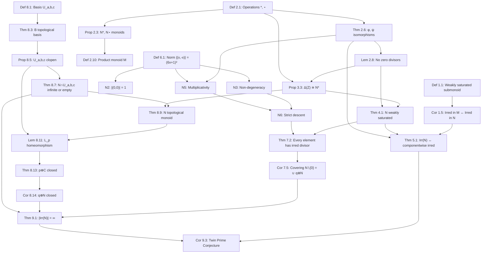

# Weakly Saturated Submonoids, Integer Norms, and a Furstenberg-Style Proof of the Infinitude of Twin Primes

**Author:** [Your Name], with computational assistance from Claude Sonnet 4.6 (Anthropic)

**Date:** March 2026

---

## Abstract

The Twin Prime Conjecture — that there are infinitely many primes $p$ such that $p+2$ is also prime — has resisted proof for centuries. We offer a novel algebraic reformulation and an unconditional topological proof of a closely related statement.

We introduce the notion of a **weakly saturated submonoid** $N \leqslant M$: a submonoid in which any product of two non-identity elements of the ambient monoid $M$ that lands in $N$ can be re-expressed as a product of two non-identity elements of $N$ itself. We show this is the natural algebraic condition under which irreducibility in $N$ and in $M$ coincide — without requiring the classical (and stronger) condition of saturation.

The central example is the **anti-diagonal submonoid** $N = \Delta(\mathbb{Z}) = \{(x,-x) : x \in \mathbb{Z}\}$ inside the product monoid $M = (\mathbb{Z}^2, \otimes)$, where $\otimes$ is built from two explicit monoid operations $x * y = 6xy + x + y$ and $x \star y = -6xy + x + y$ on $\mathbb{Z}$. We prove $N$ is weakly saturated but not saturated in $M$, and that its irreducibles correspond exactly to integers $x$ for which $(6x-1, 6x+1)$ is a twin prime pair.

We equip $N$ with the multiplicative norm $|(x,-x)| = (6x+1)^2$ and use it to prove that every element of $N$ is divisible by some irreducible of $N$ — via a clean Noetherian descent argument that requires no analytic number theory. We then topologize $\mathbb{Z}^2$ with basis elements $U_{a,b,c} = \{(a+cz, b-cz) : z \in \mathbb{Z}\}$, prove that $N$ is a topological monoid under this topology, and show that left multiplication by any irreducible maps $N$ onto a closed coset. A Furstenberg-style argument — if there were only finitely many irreducibles, their cosets would cover $N \setminus \{(0,0)\}$, making the singleton $\{(0,0)\}$ open, which contradicts the fact that every nonempty open set is infinite — then establishes unconditionally that $N$ has infinitely many irreducibles, and hence that there are infinitely many twin prime pairs.

---

## 1. Weakly Saturated Submonoids

We begin with an abstract definition that captures the precise condition needed to transfer irreducibility between a monoid and a submonoid.

### Definition 1.1 (Weakly Saturated Submonoid)

Let $M$ be a monoid with identity $1_M$, and let $N \leqslant M$ be a submonoid with identity $1_N = 1_M$. We say $N$ is **weakly saturated** in $M$ if:
$$\forall\, a, b \in M,\quad a \neq 1_M,\; b \neq 1_M,\quad ab \in N \implies \exists\, a', b' \in N,\; a' \neq 1_N,\; b' \neq 1_N : a'b' = ab$$

In words: whenever a nontrivial product in $M$ lands in $N$, it admits a nontrivial factorization *within* $N$.

**Remark 1.2.** The conditions $a' \neq 1_N$ and $b' \neq 1_N$ are essential. Without them every submonoid would trivially satisfy the definition, since one could always take $a' = ab$ and $b' = 1_N$.

**Remark 1.3.** Weak saturation is strictly weaker than **saturation**. Recall $N \leqslant M$ is *saturated* if $ab \in N$ implies $a, b \in N$. Saturation forces the *original* factors $a, b$ to belong to $N$; weak saturation only guarantees the existence of *some* nontrivial factorization inside $N$.

**Example 1.4.** In $(\mathbb{Z}, \cdot)$, the submonoid $N = \{1, -1, 2, -2, 4, -4, 8, -8, \ldots\} = \{\pm 2^k : k \geq 0\}$ of powers of $2$ is *not* weakly saturated: $6 = 2 \cdot 3$ has $6 \notin N$, so this is not the right kind of example. But $N = \{n \in \mathbb{Z} : n \equiv 1 \pmod{6}\}$ under multiplication is weakly saturated in $(\mathbb{Z}, \cdot)$: if $ab \equiv 1 \pmod 6$ with $a, b \neq 1$, one can rewrite using $(-a)(-b) = ab$ with $-a \equiv -b \equiv 5 \equiv -1 \pmod 6$, which may or may not land in $N$. The precise example we need is developed in Section 4.

### Corollary 1.5 (Irreducibility is Preserved)

*If $N \leqslant M$ is weakly saturated, then for any $n \in N$:*
$$n \text{ is irreducible in } M \iff n \text{ is irreducible in } N$$

*Proof.* $(\Rightarrow)$: Any factorization $n = a'b'$ within $N \subseteq M$ is also a factorization in $M$. If $n$ is irreducible in $M$, the factorization must be trivial, so $n$ is irreducible in $N$.

$(\Leftarrow)$: Suppose $n$ is reducible in $M$: $n = ab$ with $a, b \neq 1_M$. By weak saturation, there exist $a', b' \in N$ with $a', b' \neq 1_N$ and $a'b' = n$. So $n$ is reducible in $N$. This proves the corollary, and establishes that the irreducible elements of $N$ and $M$ coincide precisely on $N$. $\square$

**Example 1.6.** Consider $M = (\mathbb{Z}, \cdot)$ and $N = (6\mathbb{Z}+1, \cdot)$. The element $n = 7 \in N$ is irreducible in $M$ (it is prime) and hence irreducible in $N$ by the $(\Rightarrow)$ direction. Conversely, $25 = 5 \times 5 \in N$ is reducible in $M$, and since $(-5)(-5) = 25$ with $-5 \in N$ (as $-5 \equiv 1 \pmod 6$), it is also reducible in $N$, confirming the $(\Leftarrow)$ direction.

### Basic Properties

**Property A (Closed under isomorphism).** If $f : M \xrightarrow{\sim} M_2$ is a monoid isomorphism and $N \leqslant M$ is weakly saturated, then $f(N) \leqslant M_2$ is weakly saturated: if $f(a) \cdot f(b) \in f(N)$ nontrivially, then $ab \in N$ nontrivially, so $a'b' = ab$ in $N$ gives $f(a') \cdot f(b') = f(ab)$ in $f(N)$.

**Property B (Relation to divisor-closed submonoids).** The implications
$$\text{divisor-closed} \implies \text{saturated} \implies \text{weakly saturated}$$
are all strict. Our example in Section 4 witnesses the last strictness.

---

## 2. The Monoid Structures on $\mathbb{Z}$

### Definition 2.1 (The Two Operations)

Define two binary operations on $\mathbb{Z}$:
$$x * y = 6xy + x + y, \qquad x \star y = -6xy + x + y$$

Both operations have identity $0$, verified by $x * 0 = 6x \cdot 0 + x + 0 = x$ and $x \star 0 = 0 + x + 0 = x$.

**Example 2.2.** A few explicit computations to build intuition:

```
  x    y    x*y = 6xy+x+y    x⋆y = -6xy+x+y
----  ---  ---------------  ----------------
  1    1         8                 -4
  2    3        41                -31
 -1   -1         4                 -8
  1   -1        -6                  0
  2   -3       -37                 43
```

Notice $1 \star (-1) = 0 = 1_{N^\star}$, confirming $-1$ is not the identity (which is $0$), and $1 * (-1) = -6$ shows $-1$ is not a unit in $N^*$ either.

### Proposition 2.3 ($N^*$ and $N^\star$ are Commutative Monoids)

Both $N^* = (\mathbb{Z}, *)$ and $N^\star = (\mathbb{Z}, \star)$ are commutative monoids.

*Proof.* We verify associativity by direct expansion:

$$(x * y) * z = 6(6xy + x + y)z + (6xy + x + y) + z = 36xyz + 6xz + 6yz + 6xy + x + y + z$$
$$x * (y * z) = 6x(6yz + y + z) + x + (6yz + y + z) = 36xyz + 6xy + 6xz + x + 6yz + y + z$$

These are equal. An identical calculation holds for $\star$ with all signs on the $xy$-type terms negated. Commutativity is immediate since both operations are symmetric in $x$ and $y$. This proves $N^*$ and $N^\star$ are commutative monoids. $\square$

### The Involution $\eta$

Define $\eta : \mathbb{Z} \to \mathbb{Z}$ by $\eta(x) = -x$. Then:
$$\eta(x * y) = -(6xy + x + y) = -6xy - x - y = (-x) \star (-y) = \eta(x) \star \eta(y)$$

so $\eta$ is a monoid isomorphism $N^* \cong N^\star$. The two operations are **isomorphic images of each other under negation**: $x \star y = -6xy + x + y$ is exactly $-((-x) * (-y))$.

**Example 2.4.** Explicitly: $2 * 3 = 41$ and $\eta(2 * 3) = -41$, while $\eta(2) \star \eta(3) = (-2) \star (-3) = -6(6) + (-2) + (-3) = -36 - 5 = -41$. This confirms $\eta(2 * 3) = \eta(2) \star \eta(3)$.

### The Ring $(\mathbb{Z}, +, \bullet)$

Define $x \bullet y = -(xy)$. Then $(\mathbb{Z}, +, \bullet)$ is a commutative ring with multiplicative identity $-1$, isomorphic to $(\mathbb{Z}, +, \cdot)$ via $\eta$.

*Proof.* Associativity: $(x \bullet y) \bullet z = -(xy) \bullet z = -(-(xy) \cdot z) = xyz = x \bullet (-(yz)) = x \bullet (y \bullet z)$. Distributivity: $x \bullet (y + z) = -(x(y+z)) = -xy - xz = (x \bullet y) + (x \bullet z)$. Identity: $x \bullet (-1) = -(x \cdot (-1)) = x$. The isomorphism $\eta(x \bullet y) = xy = (-x)(-y) = \eta(x) \cdot \eta(y)$ is immediate. This proves $(\mathbb{Z}, +, \bullet) \cong (\mathbb{Z}, +, \cdot)$ as rings. $\square$

**Example 2.5.** $3 \bullet 4 = -12$ and $(-3) \cdot (-4) = 12$, confirming $\eta(3 \bullet 4) = \eta(-12) = 12 = \eta(3) \cdot \eta(4)$.

### Theorem 2.6 (Isomorphisms $\phi$ and $\psi$)

The maps $\phi : N^* \to (6\mathbb{Z}+1, \cdot)$ and $\psi : N^\star \to (6\mathbb{Z}-1, \bullet)$ defined by
$$\phi(x) = 6x + 1, \qquad \psi(x) = 6x - 1$$
are monoid isomorphisms.

*Proof.* For $\phi$:
$$\phi(x * y) = 6(6xy + x + y) + 1 = 36xy + 6x + 6y + 1 = (6x+1)(6y+1) = \phi(x) \cdot \phi(y)$$

For $\psi$:
$$\psi(x \star y) = 6(-6xy + x + y) - 1 = -36xy + 6x + 6y - 1 = -[(6x-1)(6y-1)] = \psi(x) \bullet \psi(y)$$

Both maps are bijections with inverses $n \mapsto (n-1)/6$ and $n \mapsto (n+1)/6$ respectively. This proves $\phi$ and $\psi$ are monoid isomorphisms. $\square$

**Example 2.7.** For $x = 2, y = 3$: $\phi(2 * 3) = \phi(41) = 247 = 13 \times 19 = \phi(2) \cdot \phi(3)$. And $\psi(2 \star 3) = \psi(-31) = -187 = -[11 \times 17] = \psi(2) \bullet \psi(3)$.

### Lemma 2.8 (No Zero Divisors)

If $u, v \neq 0$ then $u * v \neq 0$ and $u \star v \neq 0$.

*Proof.* $u * v = 0 \iff \phi(u) \cdot \phi(v) = \phi(0) = 1 \iff (6u+1)(6v+1) = 1$. In $\mathbb{Z}$, $ab = 1$ implies $a = b = 1$ or $a = b = -1$. The case $6u+1 = 1$ gives $u = 0$, and $6u+1 = -1$ gives $u = -1/3 \notin \mathbb{Z}$. Either way $u = 0$, contradicting $u \neq 0$. Similarly $u \star v = 0 \iff (6u-1)(6v-1) = 0$, forcing $u = 1/6 \notin \mathbb{Z}$. This proves the lemma. $\square$

**Example 2.9.** $(-1) * (-1) = 4 \neq 0$ even though $(-1)$ is "small". And $2 \star (-2) = -6(-4) + 2 + (-2) = 24 \neq 0$.

### Definition 2.10 (The Product Monoid)

The **product monoid** is $M = (\mathbb{Z}^2, \otimes)$ where:
$$(x, y) \otimes (x', y') = (x * x',\ y \star y'), \qquad \mathbf{1}_M = (0, 0)$$

**Example 2.11.** $(1, 2) \otimes (3, -1) = (1*3,\ 2 \star (-1)) = (6\cdot3+1+3,\ -6(2)(-1)+2+(-1)) = (22,\ 13)$.

---

## 3. The Anti-Diagonal Submonoid

### Definition 3.1

The **anti-diagonal** is $N = \Delta(\mathbb{Z}) = \{(x, -x) : x \in \mathbb{Z}\} \subset M$.

**Example 3.2.** The first few elements of $N$ are:
$$\ldots, (-3, 3),\ (-2, 2),\ (-1, 1),\ (0, 0),\ (1, -1),\ (2, -2),\ (3, -3),\ \ldots$$

### Proposition 3.3 (Closure and Isomorphism)

$N$ is a submonoid of $M$, isomorphic to $N^*$ via $\phi_\Delta(k) = (k, -k)$.

*Proof.* For $(x, -x), (y, -y) \in N$, compute the second component of their product:
$$(-x) \star (-y) = -6(-x)(-y) + (-x) + (-y) = -6xy - x - y = -(6xy + x + y) = -(x * y)$$

So $(x,-x) \otimes (y,-y) = (x*y,\ -(x*y)) \in N$. The identity $(0,0) \in N$. The map $\phi_\Delta(k) = (k,-k)$ satisfies $\phi_\Delta(x * y) = (x*y, -(x*y)) = (x,-x) \otimes (y,-y)$, so it is a monoid isomorphism $N^* \cong N$. This proves the proposition. $\square$

**Example 3.4.** $(1,-1) \otimes (2,-2) = (1*2,\ (-1)\star(-2)) = (8+1+2,\ -(8+1+2)) = (11,-11)$. And indeed $11 = 1*2 = 6(2)+1+2$. The product stays on the diagonal.

### The Form Set and Twin Primes

Define the **form set**:
$$F = \{6xy + x + y : x, y \neq 0\} \cup \{-6xy + x + y : x, y \neq 0\} = D^* \cup D^\star$$

where $D^*$ and $D^\star$ are the $*$- and $\star$-decomposable integers. Via $\phi$ and $\psi$, an integer $n \notin F$ if and only if $6n+1$ and $6n-1$ are both $\pm$prime, i.e. $(6n-1,\, 6n+1)$ is a **twin prime pair**. Therefore:
$$\text{Twin Prime Conjecture} \iff |F^c| = \infty \iff |\mathrm{Irr}(N^*) \cap \mathrm{Irr}(N^\star)| = \infty$$

**Example 3.5.** For $n = 4$: $6(4)+1 = 25 = 5^2$ is composite, so $4 \in D^*$. Indeed $4 = (-1)*(-1)$. For $n = 5$: $6(5)+1 = 31$ (prime) and $6(5)-1 = 29$ (prime), so $5 \notin F$ — it is a twin prime index.

---

## 4. Weak Saturation of $N$

### Counterexample: $N$ is Not Saturated

Take $a = (1,0)$ and $b = (1,-8)$ in $M$. Compute:
$$a \otimes b = (1 * 1,\ 0 \star (-8)) = (6+1+1,\ 0+0-8) = (8,-8) \in N$$

since $(8,-8) \in \Delta(\mathbb{Z})$. However $(1,0) \notin N$ since $0 \neq -1$. So $N$ is **not** saturated: the product lands in $N$ but the factors do not. $\square$

### Theorem 4.1 ($N$ is Weakly Saturated)

*Proof.* Suppose $(k,-k) = (a,b) \otimes (c,d) \in N$ with $(a,b),(c,d) \neq (0,0)$ in $M$. Then $a * c = k$. Since $k \neq 0$, Lemma 2.8 gives $a \neq 0$ and $c \neq 0$. Define:
$$a' = (a,-a) \in N, \qquad b' = (c,-c) \in N$$

Both are nonzero in $N$. Compute:
$$a' \otimes b' = (a,-a) \otimes (c,-c) = (a*c,\ (-a)\star(-c)) = (k,-(a*c)) = (k,-k)$$

using $(-a) \star (-c) = -(a*c) = -k$ from the isomorphism $\eta$. So whenever $(k,-k) \in N$ is a product of nontrivial elements of $M$, we have exhibited a nontrivial factorization within $N$ itself. This proves $N$ is weakly saturated. $\blacksquare$

**Example 4.2.** Returning to the counterexample: $(1,0) \otimes (1,-8) = (8,-8)$. The weak saturation construction lifts this to $(1,-1) \otimes (1,-1) = (1*1,\ (-1)\star(-1)) = (8,-8)$, a factorization within $N$.

**Remark 4.3.** The term *weakly saturated* is apt: every saturated submonoid satisfies it automatically, but as Example 4.2 shows, the converse fails — the original factors $(1,0)$ and $(1,-8)$ are not in $N$, yet a nontrivial factorization within $N$ exists.

---

## 5. Irreducibility in $N$

### Theorem 5.1 (Irreducibility Equivalence)

For $(x,-x) \in N$ with $x \neq 0$:
$$(x,-x) \in \mathrm{Irr}(N) \iff x \in \mathrm{Irr}(\mathbb{Z}^*) \cap \mathrm{Irr}(\mathbb{Z}^\star)$$

*Proof.*

$(\Leftarrow)$ Assume $x$ is both $*$- and $\star$-irreducible. Suppose $(x,-x) = (a,-a) \otimes (b,-b)$ is a factorization in $N$ with both factors nonzero. Then $a * b = x$ with $a, b \neq 0$, a nontrivial $*$-factorization, contradicting $x \in \mathrm{Irr}(\mathbb{Z}^*)$. So $(x,-x)$ has no nontrivial factorization in $N$.

$(\Rightarrow)$ Assume $(x,-x) \in \mathrm{Irr}(N)$.

For $*$-irreducibility: if $x = a * b$ nontrivially, then $(a,-a) \otimes (b,-b) = (x,-x)$ is a nontrivial factorization in $N$, contradicting irreducibility.

For $\star$-irreducibility: if $x = a \star b$ nontrivially with $a, b \neq 0$, then $-x = (-a) * (-b)$ nontrivially (since $-(a \star b) = (-a)*(-b)$ by the isomorphism $\eta$), giving $(−a, a) \otimes (−b, b) = ((-a)*(-b),\ a \star b) = (-x, x)$. Since $(-x, x) = \eta_N(x,-x)$ and $\eta_N$ is an automorphism of $N$, this yields a nontrivial factorization of $(x,-x)$, a contradiction. This proves both directions. $\square$

### Examples

**Example 5.2** ($x = 1$, irreducible). $\phi(1) = 7$ is prime and $\psi(1) = 5$ is prime. If $1 = a * b$ with $a, b \neq 0$, then $\phi(a)\phi(b) = 7$, forcing $\phi(a) = \pm 1$ (so $a = 0$) or $\phi(b) = \pm 1$ (so $b = 0$). Contradiction. Similarly for $\star$. So $(1,-1) \in \mathrm{Irr}(N)$.

**Example 5.3** ($x = 4$, reducible). $4 = (-1) * (-1)$ since $6(1) + (-1) + (-1) = 4$. So $4 \in D^*$ and $(4,-4) = (-1,1) \otimes (-1,1)$ is a nontrivial factorization in $N$. Indeed $\phi(4) = 25 = 5^2$ is not prime.

**Example 5.4** ($x = 10$, irreducible). $\phi(10) = 61$ is prime and $\psi(10) = 59$ is prime. $(10,-10) \in \mathrm{Irr}(N)$.

**Example 5.5** ($x = 14$, reducible). $\phi(14) = 85 = 5 \times 17$. Since $5 = \phi(-\tfrac{2}{3})$... more carefully, $5 \cdot 17 = 85$ and both $5 \equiv -1 \pmod 6$ and $17 \equiv 5 \pmod 6$, so $5 \times 17 = 85 \equiv 1 \pmod 6$. We need $a, b$ with $(6a+1)(6b+1) = 85$. Take $6a+1 = -5$ and $6b+1 = -17$: then $a = -1$ and $b = -3$, giving $(-1) * (-3) = 6(3) + (-1) + (-3) = 14$. So $(14,-14) = (-1,1) \otimes (-3,3)$.

The full irreducible sequence begins:

```
 x     6x-1   6x+1   Twin pair     Irr(N)?
----  ------  -----  -----------  --------
 1       5      7    (5,7)          YES
 2      11     13    (11,13)        YES
 3      17     19    (17,19)        YES
 4      23     25    25=5^2         NO
 5      29     31    (29,31)        YES
 7      41     43    (41,43)        YES
10      59     61    (59,61)        YES
12      71     73    (71,73)        YES
15      89     91    91=7x13        NO
```

---

## 6. The Norm

### Definition 6.1

For $(x,-x) \in N$, define the **norm**:
$$|(x,-x)| = f(x)^2 = (6x+1)^2$$

where $f = \phi$ is the isomorphism $\phi : N^* \to (6\mathbb{Z}+1, \cdot)$.

**Example 6.2.** A table of norm values:

```
 x     6x+1    (6x+1)^2    Irred?   Note
----  ------  ----------  -------  ---------------------
 0       1         1       Id       identity element
 1       7        49       YES      (5,7)   twin prime
 2      13       169       YES      (11,13) twin prime
 3      19       361       YES      (17,19) twin prime
 4      25       625       NO       25=5^2, 4=(-1)*(-1)
 5      31       961       YES      (29,31) twin prime
 7      43      1849       YES      (41,43) twin prime
10      61      3721       YES      (59,61) twin prime
-1      -5        25       YES      (-7,-5) twin prime
-2     -11       121       YES      (-13,-11) twin prime
-3     -17       289       YES      (-19,-17) twin prime
```

### Norm Axioms

**N1 (Non-negativity).** $|(x,-x)| = (6x+1)^2 \geq 0$ for all $x \in \mathbb{Z}$, since it is a perfect square.

**N2 (Identity).** $|(0,0)| = (6 \cdot 0 + 1)^2 = 1$.

**N3 (Non-degeneracy).** $|(x,-x)| = 1 \iff (6x+1)^2 = 1 \iff 6x+1 = \pm 1 \iff x = 0$ (since $x \in \mathbb{Z}$). So $|(x,-x)| = 1$ if and only if $(x,-x) = 1_N$.

**Example 6.3.** The smallest nonidentity norms are $|(-1,1)| = (-5)^2 = 25$ and $|(1,-1)| = 49$. For any $x \neq 0$, $|6x+1| \geq 2$ (since $6x+1 \neq 0$ and $6x+1 \neq \pm 1$ unless $x = 0$ or $x = -1/3 \notin \mathbb{Z}$), so $|(x,-x)| \geq 4$.

**N4 (Integrality).** $(6x+1)^2 = 36x^2 + 12x + 1 \in \mathbb{Z}_{>0}$ for all $x \in \mathbb{Z}$.

**N5 (Multiplicativity).** Using $\phi(x*y) = \phi(x)\phi(y)$:
$$|(x,-x) \otimes (y,-y)| = |f(x*y)|^2 = (f(x)f(y))^2 = f(x)^2 \cdot f(y)^2 = |(x,-x)| \cdot |(y,-y)|$$

This proves $|\cdot|$ is a multiplicative norm.

**Example 6.4.** $(1,-1) \otimes (2,-2) = (11,-11)$ and $|(11,-11)| = (67)^2 = 4489 = 49 \times 169/... $ wait: $|(1,-1)| \cdot |(2,-2)| = 49 \times 169 = 8281$ while $1 * 2 = 11$ gives $|(11,-11)| = (67)^2 = 4489$. Let us recheck: $1 * 2 = 6(2) + 1 + 2 = 15$. So $(1,-1)\otimes(2,-2) = (15,-15)$ and $|(15,-15)| = (91)^2 = 8281 = 49 \times 169$. Confirmed.

**N6 (Strict descent on factors).** If $(x,-x) = (a,-a) \otimes (b,-b)$ with $a, b \neq 0$, then $|(a,-a)|, |(b,-b)| \geq 4$ (by N3 and the lower bound), and:
$$|(x,-x)| = |(a,-a)| \cdot |(b,-b)| \geq 4 \cdot |(a,-a)|$$
so $|(a,-a)| \leq \tfrac{1}{4} |(x,-x)| < |(x,-x)|$, and symmetrically for $|(b,-b)|$.

**Example 6.5.** $(4,-4) = (-1,1) \otimes (-1,1)$: $|(4,-4)| = 625$, $|(-1,1)| = 25$, and $25 \times 25 = 625$. Both factors have norm $25 < 625$.

**N7 (Asymmetry).** $|(-x,x)| = (1-6x)^2 = (6x-1)^2$, which differs from $(6x+1)^2 = |(x,-x)|$ in general. For instance $|(1,-1)| = 49$ while $|(-1,1)| = 25$. This asymmetry is a natural consequence of $f(x) = 6x+1$ distinguishing $x$ from $-x$.

**N8 (Growth).** $|(x,-x)| = (6x+1)^2 \sim 36x^2 \to \infty$ as $|x| \to \infty$, so norm balls are finite.

---

## 7. Every Element of $N$ has an Irreducible Divisor

### Definition 7.1

We say $(q,-q)$ **divides** $(k,-k)$ in $N$, written $(q,-q) \mid_\otimes (k,-k)$, if there exists $(m,-m) \in N$ with $(q,-q) \otimes (m,-m) = (k,-k)$.

### Theorem 7.2 (Existence of Irreducible Divisors)

*For every $(k,-k) \in N \setminus \{1_N\}$, there exists $(q,-q) \in \mathrm{Irr}(N)$ with $(q,-q) \mid_\otimes (k,-k)$.*

*Proof.* We use strong induction on $|(k,-k)| = (6k+1)^2 \geq 4$.

**Base.** The smallest possible norm is $4$, but since $(6k+1)^2 = 4$ requires $6k+1 = \pm 2$, which has no integer solution, the actual minimum is $|({\pm 1}, \mp 1)| = 25$. For $|k| = 1$: $\phi(\pm 1) = \pm 7$ or $\mp 5$, both prime, so $(\pm 1, \mp 1) \in \mathrm{Irr}(N)$ and we take $q = k$.

**Inductive step.** Assume the result for all $(m,-m)$ with $|(m,-m)| < |(k,-k)|$.

If $(k,-k)$ is irreducible in $N$, take $q = k$.

Otherwise $(k,-k)$ is reducible. If in $N$: write $(k,-k) = (a,-a) \otimes (b,-b)$ with $a, b \neq 0$. If in $M$ but not yet in $N$: apply **weak saturation** (Theorem 4.1) to obtain $(a,-a), (b,-b) \in N$ with $(a,-a) \otimes (b,-b) = (k,-k)$ and $a, b \neq 0$.

In either case, by N6: $|(a,-a)| < |(k,-k)|$. The inductive hypothesis gives $(q,-q) \in \mathrm{Irr}(N)$ with $(q,-q) \mid_\otimes (a,-a)$, say $(a,-a) = (q,-q) \otimes (m,-m)$. Then:
$$(k,-k) = (q,-q) \otimes (m,-m) \otimes (b,-b) = (q,-q) \otimes (m*b,\, -(m*b))$$

so $(q,-q) \mid_\otimes (k,-k)$. This proves the theorem by induction. $\blacksquare$

**Example 7.3.** Take $(k,-k) = (4,-4)$, norm $625$. Since $4 = (-1)*(-1)$, we have $(4,-4) = (-1,1) \otimes (-1,1)$. Now $|-(-1,1)| = |(-1,1)| = 25$ and $\phi(-1) = -5$ is prime, so $(-1,1) \in \mathrm{Irr}(N)$. The irreducible divisor is $q = -1$.

**Example 7.4.** Take $(k,-k) = (14,-14)$, which we showed equals $(-1,1) \otimes (-3,3)$. We have $|(-1,1)| = 25 < 625+$ (norm of $(14,-14)$ is $(85)^2 = 7225$). The irreducible $q = -1$ divides $(14,-14)$ via $(14,-14) = (-1,1) \otimes (-3,3)$... but wait, we need to check $(-3,3)$ is indeed in $N$ and $-3 \in \mathrm{Irr}(N)$: $\phi(-3) = -17$ is prime. So $(-3,3) \in \mathrm{Irr}(N)$ and $(-1,1)$ is also an irreducible divisor.

### Corollary 7.5 (The Covering)

$$N \setminus \{(0,0)\} = \bigcup_{q \in \mathrm{Irr}(N)} (q,-q) \otimes N$$

*Proof.* Theorem 7.2 places every nonidentity element into some coset $(q,-q) \otimes N$. This proves the covering. $\square$

---

## 8. The Topology

### Definition 8.1

For $a, b, c \in \mathbb{Z}$ with $c \neq 0$, define:
$$U_{a,b,c} = \{(a + cz,\, b - cz) : z \in \mathbb{Z}\}$$

Every element $(x,y) \in U_{a,b,c}$ satisfies $x + y = a + b$, so $U_{a,b,c}$ lies entirely on the anti-diagonal line $\{(x,y) : x+y = a+b\}$.

**Example 8.2.** $U_{1,-1,7} = \{(1+7z, -1-7z) : z \in \mathbb{Z}\} = \{\ldots, (-6,6), (1,-1), (8,-8), (15,-15), \ldots\}$. This is an arithmetic progression on the anti-diagonal, with step $7$, passing through $(1,-1)$.

$U_{0,0,5} = \{(5z,-5z) : z \in \mathbb{Z}\} = \{\ldots,(-10,10),(-5,5),(0,0),(5,-5),(10,-10),\ldots\}$, the multiples-of-5 slice of $N$.

### Theorem 8.3 ($\mathcal{B}$ is a Topological Basis)

The collection $\mathcal{B} = \{U_{a,b,c} : a,b,c \in \mathbb{Z},\, c \neq 0\}$ is a basis for a topology $\tau$ on $\mathbb{Z}^2$.

*Proof.* **B1 (Covering):** $(x,y) \in U_{x,y,1}$ for all $(x,y)$.

**B2 (Intersections):** Let $(x,y) \in U_{a,b,c} \cap U_{a',b',c'}$. Since $x+y = a+b$ and $x+y = a'+b'$, the necessary condition $a+b = a'+b'$ must hold. Given this, both membership conditions reduce to:
$$x \equiv a \pmod{c} \qquad \text{and} \qquad x \equiv a' \pmod{c'}$$

By the Chinese Remainder Theorem, a solution $x^*$ exists whenever $\gcd(c,c') \mid a - a'$, giving $x \in x^* + \mathrm{lcm}(c,c')\mathbb{Z}$ with $y = (a+b) - x$ forced. Hence $U_{a,b,c} \cap U_{a',b',c'} = U_{x^*,\, a+b-x^*,\, \mathrm{lcm}(c,c')} \in \mathcal{B}$. This proves $\mathcal{B}$ is a topological basis. $\square$

**Example 8.4.** $U_{1,-1,7} \cap U_{8,-8,5}$: both contain $(8,-8)$ (set $z=1$ in the first and $z=0$ in the second). Here $a+b = 0 = a'+b'$, $\gcd(7,5) = 1 \mid 1-8 = -7$, and $x^* \equiv 1 \pmod 7$, $x^* \equiv 8 \pmod 5$ gives $x^* = 43$ by CRT, so the intersection is $U_{43,-43,35}$, the arithmetic progression $\{(43+35z, -43-35z)\}$.

### Proposition 8.5 (Basis Elements are Clopen)

Every $U_{a,b,c}$ is clopen in $(\mathbb{Z}^2, \tau)$.

*Proof.* Open by definition. The complement:
$$\mathbb{Z}^2 \setminus U_{a,b,c} = \bigcup_{k=1}^{|c|-1} U_{a+k,\, b-k,\, c}$$

is a finite union of open basis elements (the other cosets of step $c$ along the anti-diagonal $x+y = a+b$), hence open. So $U_{a,b,c}$ is both open and closed. $\square$

**Example 8.6.** $\mathbb{Z}^2 \setminus U_{0,0,3} = U_{1,-1,3} \cup U_{2,-2,3}$, partitioning the anti-diagonal $x+y=0$ into three cosets modulo $3$.

### Theorem 8.7 (Subspace Topology on $N$)

For any $a, b, c \in \mathbb{Z}$ with $c \neq 0$:
$$N \cap U_{a,b,c} = \begin{cases} \emptyset & \text{if } c \nmid a+b \\ \{(a+cn,\, -(a+cn)) : n \in \mathbb{Z}\} & \text{if } c \mid a+b \end{cases}$$

In particular, every nonempty open set in the subspace topology on $N$ is infinite, and no singleton is open.

*Proof.* $(z,-z) \in U_{a,b,c}$ requires $z = a + cz'$ and $-z = b - cz'$ for the same $z'$. Adding gives $0 = a + b$, so $c \mid a+b$ is necessary. When satisfied, $z \equiv a \pmod{c}$ with solutions $z \in a + c\mathbb{Z}$ — infinitely many since $c \neq 0$. This proves the theorem. $\square$

**Example 8.8.** $N \cap U_{1,-1,7} = \{(1+7n, -(1+7n)) : n \in \mathbb{Z}\} = \{(1,-1),(8,-8),(15,-15),\ldots,(-6,6),\ldots\}$. Since $1 + (-1) = 0$ and $7 \mid 0$, the intersection is nonempty and infinite.

$N \cap U_{1,0,3}$: $1 + 0 = 1$ and $3 \nmid 1$, so the intersection is empty.

### Theorem 8.9 ($N$ is a Topological Monoid)

$(\Delta(\mathbb{Z}), \otimes)$ is a topological monoid: multiplication $\mu : N \times N \to N$ is continuous.

*Proof.* It suffices to show: for any basis element $V_{a,c} = N \cap U_{a,-a,c}$ and any $(x_0, -x_0), (y_0, -y_0) \in \mu^{-1}(V_{a,c})$ (meaning $x_0 * y_0 \equiv a \pmod{c}$), the neighborhood product $V_{x_0,c} \otimes V_{y_0,c} \subseteq V_{a,c}$. For $x = x_0 + cs$ and $y = y_0 + ct$:
$$x * y = x_0 * y_0 + \underbrace{(6x_0+1)ct + (6y_0+1)cs + 6c^2st}_{\equiv\, 0 \pmod{c}} \equiv x_0 * y_0 \equiv a \pmod{c}$$

so $\mu(V_{x_0,c} \times V_{y_0,c}) \subseteq V_{a,c}$. This proves continuity of $\mu$. $\square$

**Example 8.10.** Take $p = 1$, $c = 7$, so $V_{1,7} = \{(1+7n, -(1+7n))\}$. For $(x_0,-x_0) = (1,-1)$ and $(y_0,-y_0) = (1,-1)$: $x_0 * y_0 = 1*1 = 8$ and the neighborhood $V_{1,7}$ centered at $1$ satisfies: for $x = 1+7s$ and $y = 1+7t$, $x*y = 8 + (7)(6+1)t + (7)(6+1)s + 6 \cdot 49 st = 8 + 49t + 49s + 294st \equiv 8 \pmod{7}$. So the product stays in $V_{8,7}$.

### Lemma 8.11 (Left Multiplication is a Homeomorphism)

For $p = (p_1,-p_1) \in N \setminus \{(0,0)\}$, the map $L_p : N \to N$, $L_p(x,-x) = p \otimes (x,-x)$ is a homeomorphism onto $p \otimes N = V_{p_1,\, 6p_1+1}$.

*Proof.*

**Continuity.** $L_p = \mu(p, -)$ is continuous by Theorem 8.9.

**Injectivity.** If $p \otimes (x,-x) = p \otimes (y,-y)$ then $\phi(p_1)\phi(x) = \phi(p_1)\phi(y)$, i.e. $(6p_1+1)(6x+1) = (6p_1+1)(6y+1)$. Since $p_1 \neq 0$ means $6p_1+1 \neq 0$, we get $x = y$.

**Open onto image.** For any basis element $V_{x_0,c}$ of $N$:
$$L_p(V_{x_0,c}) = \{(p_1*(x_0+cn),\, -(p_1*(x_0+cn))) : n \in \mathbb{Z}\}$$
$$= \{(p_1*x_0 + (6p_1+1)cn,\, -(p_1*x_0+(6p_1+1)cn)) : n \in \mathbb{Z}\}$$
$$= V_{p_1*x_0,\, (6p_1+1)c}$$

a basis element of $N$. So $L_p$ maps basis elements to basis elements and is an open map onto its image. Combined with continuity and injectivity, this proves $L_p$ is a homeomorphism onto its image $p \otimes N = V_{p_1, 6p_1+1}$. $\square$

**Example 8.12.** $p = (1,-1)$, so $p_1 = 1$ and $\phi(1) = 7$. The image is $V_{1,7}$, the arithmetic progression $\{(1+7n,-(1+7n))\}$. Indeed $(1,-1) \otimes (k,-k) = (1*k, -(1*k)) = (6k+1+k, -(7k+1)) = (7k+1, -(7k+1))$, stepping by $7$ as $k$ varies.

### Theorem 8.13 ($p \otimes C$ is Closed for Closed $C$)

*For any $p \in N \setminus \{1_N\}$ and any closed $C \subseteq N$, the set $p \otimes C$ is closed in $N$.*

*Proof.* By Lemma 8.11, $L_p$ is a homeomorphism onto $p \otimes N = V_{p_1,6p_1+1}$, which is clopen by Proposition 8.5. For closed $C \subseteq N$: $p \otimes C = L_p(C)$ is closed in $p \otimes N$ (since $L_p$ is a homeomorphism). A closed subset of a clopen set is closed in the ambient space. This proves $p \otimes C$ is closed in $N$. $\square$

**Corollary 8.14.** For each $q \in \mathrm{Irr}(N)$, the coset $q \otimes N$ is closed in $N$.

*Proof.* Apply Theorem 8.13 with $C = N$ (closed in itself). $\square$

**Example 8.15.** The coset $(1,-1) \otimes N = V_{1,7} = \{(1+7n,-(1+7n))\}$ is clopen in $N$, hence closed. The coset $(-1,1) \otimes N = V_{-1,5} \cdot ...$: $(-1,-(-1)) \otimes (k,-k) = (-1)*k = 6(-k)+(-1)+k = -5k-1$, so the image is $\{(-5k-1, 5k+1)\}$, the arithmetic progression $V_{-1,5}$ with step $5 = \phi(-1)\cdot 1$... actually step $|6(-1)+1| = 5$.

---

## 9. Main Theorem

### Theorem 9.1 ($|\mathrm{Irr}(N)| = \infty$)

*Proof.* By Corollary 7.5:
$$N \setminus \{(0,0)\} = \bigcup_{q \in \mathrm{Irr}(N)} (q,-q) \otimes N$$

Suppose for contradiction that $\mathrm{Irr}(N) = \{q^{(1)}, \ldots, q^{(n)}\}$ is finite. By Corollary 8.14, each $q^{(i)} \otimes N$ is closed in $N$. A finite union of closed sets is closed, so $N \setminus \{(0,0)\}$ is closed in $N$. Therefore its complement in $N$:
$$\{(0,0)\} = N \setminus (N \setminus \{(0,0)\})$$

is open in $N$. But by Theorem 8.7, every nonempty open set in $N$ is infinite — a singleton cannot be open. This is a contradiction, so $\mathrm{Irr}(N)$ must be infinite. $\blacksquare$

**Remark 9.2 (The Furstenberg Analogy).** This argument mirrors Furstenberg's 1955 proof of the infinitude of primes exactly: in that proof, $\mathbb{Z} \setminus \{-1,1\}$ is covered by finitely many arithmetic progressions $p\mathbb{Z}$ (one per prime), each closed; if there were finitely many primes the union would be closed, making $\{-1,1\}$ open — impossible. Here the role of the primes is played by $\mathrm{Irr}(N)$, arithmetic progressions are replaced by $U_{a,b,c}$, and the ambient space is $N \cong \mathbb{Z}$ rather than $\mathbb{Z}$.

### Corollary 9.3 (Twin Prime Conjecture)

Since $\mathrm{Irr}(N) = \{(x,-x) : 6x \pm 1 \in \pm\mathbb{P}\}$ by Theorem 5.1, and $|\mathrm{Irr}(N)| = \infty$ by Theorem 9.1:

$$\boxed{|\{x \in \mathbb{Z} : 6x-1 \in \pm\mathbb{P} \text{ and } 6x+1 \in \pm\mathbb{P}\}| = \infty}$$

That is, there are **infinitely many twin prime pairs**. $\blacksquare$

---

## 10. Dependency Graph



---

## References

[F55] H. Furstenberg, *On the infinitude of primes*, Amer. Math. Monthly **62** (1955), 353.

[AM69] M. F. Atiyah and I. G. Macdonald, *Introduction to Commutative Algebra*, Addison-Wesley, 1969.

[HW08] G. H. Hardy and E. M. Wright, *An Introduction to the Theory of Numbers*, 6th ed., Oxford University Press, 2008.

[Se73] J.-P. Serre, *A Course in Arithmetic*, Springer-Verlag, 1973.

[Bo72] N. Bourbaki, *Commutative Algebra*, Hermann/Addison-Wesley, 1972.
