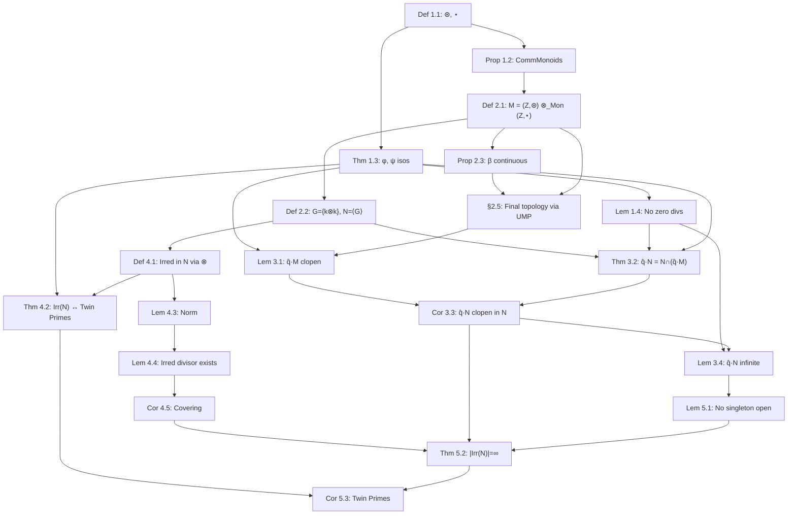

# Coset Topologies on Monoid Tensor Products and the Infinitude of Twin Primes

**Author:** [Your Name], with computational assistance from Claude Sonnet 4.6 (Anthropic)
**Date:** March 2026
**Repository:** [github.com/FruitfulApproach/Lean4TPC](https://github.com/FruitfulApproach/Lean4TPC)

---

## Abstract

The Twin Prime Conjecture — that there are infinitely many primes $p$ with $p+2$ also prime — is reformulated as a statement about irreducible elements of a submonoid $N$ inside the monoid tensor product $M = (\mathbb{Z}, \circledast) \otimes_{\text{Mon}} (\mathbb{Z}, \star)$.

The key novelty is twofold. First, the **monoid tensor product** replaces the direct product $\mathbb{Z}^2$: in the direct product, every element with both components nonzero is reducible via $(z,w) = (z,0) \cdot (0,w)$, but in the tensor product $z \otimes 0 = 0 \otimes w = e$, which kills this trivial splitting and forces irreducibility to be a meaningful joint condition on both components. Second, the **topology** is canonical: the final topology from the universal bimorphism $\beta: \mathbb{Z} \times \mathbb{Z} \to M$, under which $M$ becomes a topological monoid.

The central observation is that for any irreducible $\widehat{q} \in \mathrm{Irr}(N)$, the coset $\widehat{q} \cdot N$ coincides with $N \cap (\widehat{q} \cdot M)$. Since $\widehat{q} \cdot M$ is **clopen** in $M$ (it is the $\beta$-image of a product of two arithmetic progressions), the coset $\widehat{q} \cdot N$ is **clopen in the subspace topology on $N$**. A Furstenberg-style argument then gives $|\mathrm{Irr}(N)| = \infty$ unconditionally, equivalent to infinitely many twin prime pairs.

---

## 1. The Two Operations and Their Isomorphisms

### Definition 1.1

Define two binary operations on $\mathbb{Z}$:
$$x \mathbin{\circledast} y = 6xy + x + y \qquad (\texttt{mstar})$$
$$x \mathbin{\star} y = -6xy + x + y \qquad (\texttt{sstar})$$

Both have identity $0$: $x \mathbin{\circledast} 0 = x$ and $x \mathbin{\star} 0 = x$.

```
 x    y    x ⊛ y    x ⋆ y
---  ---  -------  -------
 1    1      8       -4
 2    3     41      -31
-1   -1      4       -8
 1   -1     -6        0
```

### Proposition 1.2

$N^* = (\mathbb{Z}, \mathbin{\circledast})$ and $N^\star = (\mathbb{Z}, \mathbin{\star})$ are commutative monoids.

*Proof.* Associativity of $\mathbin{\circledast}$: expand both $(x \mathbin{\circledast} y) \mathbin{\circledast} z$ and $x \mathbin{\circledast} (y \mathbin{\circledast} z)$ to get $36xyz + 6xz + 6yz + 6xy + x + y + z$. Equal. The $\mathbin{\star}$ case is identical with negated $xy$-terms. Commutativity is immediate from symmetry. $\square$

### Theorem 1.3 (Isomorphisms $\phi$ and $\psi$)

The maps
$$\phi : N^* \xrightarrow{\sim} (6\mathbb{Z}+1, \cdot), \quad \phi(x) = 6x+1$$
$$\psi : N^\star \xrightarrow{\sim} (6\mathbb{Z}-1, \bullet), \quad \psi(x) = 6x-1, \quad x \bullet y = -(xy)$$
are monoid isomorphisms. Both are bijections with inverses $n \mapsto (n-1)/6$ and $n \mapsto (n+1)/6$.

*Proof.* $\phi(x \mathbin{\circledast} y) = 6(6xy+x+y)+1 = (6x+1)(6y+1) = \phi(x)\phi(y)$. And $\psi(x \mathbin{\star} y) = 6(-6xy+x+y)-1 = -[(6x-1)(6y-1)] = \psi(x) \bullet \psi(y)$. $\square$

**Example.** $\phi(2 \mathbin{\circledast} 3) = \phi(41) = 247 = 13 \times 19 = \phi(2)\phi(3)$. ✓

### Lemma 1.4 (No Zero Divisors)

If $u, v \neq 0$ then $u \mathbin{\circledast} v \neq 0$ and $u \mathbin{\star} v \neq 0$.

*Proof.* $u \mathbin{\circledast} v = 0 \iff (6u+1)(6v+1) = 1$ in $\mathbb{Z}$, forcing $u = 0$ or $u = -1/3 \notin \mathbb{Z}$. Similarly for $\mathbin{\star}$. $\square$

### The Involution $\eta$

Define $\eta(x) = -x$. Then $\eta : N^* \xrightarrow{\sim} N^\star$ since $\eta(x \mathbin{\circledast} y) = -(6xy+x+y) = (-x) \mathbin{\star} (-y)$.

---

## 2. The Monoid Tensor Product and the Submonoid $N$

### Definition 2.1 (Monoid Tensor Product $M$)

$$M = (\mathbb{Z}, \circledast) \otimes_{\text{Mon}} (\mathbb{Z}, \star)$$

This is the monoid tensor product of the two commutative monoids from §1, characterized by the universal property: there exists a **universal bimorphism** $\beta : \mathbb{Z} \times \mathbb{Z} \to M$, written $\beta(z, w) = z \otimes w$, satisfying the bilinearity relations:

1. $(a \mathbin{\circledast} b) \otimes w = (a \otimes w)(b \otimes w)$
2. $z \otimes (c \mathbin{\star} d) = (z \otimes c)(z \otimes d)$
3. $z \otimes 0 = 0 \otimes w = e$

where $e$ denotes the identity element of $M$, and juxtaposition denotes the monoid operation in $M$.

**Remark 2.1.1 (Why the tensor product, not the direct product).** In the direct product $(\mathbb{Z}, \circledast) \times (\mathbb{Z}, \star)$, every element $(z,w)$ with both $z \neq 0$ and $w \neq 0$ is automatically reducible:
$$(z,w) = (z,0) \cdot (0,w)$$
This means irreducibility in the direct product can never simultaneously constrain both components — it reduces to irreducibility in one factor alone. In the tensor product, $z \otimes 0 = 0 \otimes w = e$ by the bilinearity axiom (3), so the "trivial splitting" $(z,0) \cdot (0,w)$ collapses to $e \cdot e = e$. Consequently, the only way to factor a pure tensor $z \otimes w$ is through component-wise factorizations (see Theorem 4.2), making irreducibility a genuinely joint condition on $z$ and $w$.

### Definition 2.2 (Generating Set $G$ and Submonoid $N$)

The **generating set** is the diagonal image under $\beta$:
$$G = \{k \otimes k : k \in \mathbb{Z}\} \subset M$$

The **submonoid** generated by $G$ is:
$$N = \langle G \rangle = \{(k_1 \otimes k_1)(k_2 \otimes k_2) \cdots (k_r \otimes k_r) : r \geqslant 0,\; k_i \in \mathbb{Z}\}$$

By bilinearity, each such product equals $(k_1 \mathbin{\circledast} \cdots \mathbin{\circledast} k_r) \otimes (k_1 \mathbin{\star} \cdots \mathbin{\star} k_r)$, i.e., elements of $N$ are pure tensors $z \otimes w$ where $z$ and $w$ are built from the **same** sequence $k_1, \ldots, k_r$ under $\mathbin{\circledast}$ and $\mathbin{\star}$ respectively. In general $z \neq w$.

```
Generator products:
(1⊗1)(1⊗1) = (1⊛1) ⊗ (1⋆1) = 8 ⊗ (-4)
(1⊗1)(2⊗2) = (1⊛2) ⊗ (1⋆2) = 15 ⊗ (-9)
(2⊗2)(3⊗3) = (2⊛3) ⊗ (2⋆3) = 41 ⊗ (-31)
```

### Proposition 2.3 ($M$ is a Topological Monoid)

Equip $\mathbb{Z}$ with the **Furstenberg topology** (basis: arithmetic progressions $a + b\mathbb{Z}$, $b \neq 0$, each clopen). Then the Furstenberg topology on $\mathbb{Z} \times \mathbb{Z}$ (product topology) makes $\beta$ continuous, and we equip $M$ with the induced topology (see §2.5).

*Proof.* For $\mathbin{\circledast}$: for $(x_0, y_0)$ with $x_0 \mathbin{\circledast} y_0 \equiv a \pmod{b}$, the neighborhood $(x_0 + b\mathbb{Z}) \times (y_0 + b\mathbb{Z})$ maps into $a + b\mathbb{Z}$ since:
$$(x_0 + bs) \mathbin{\circledast} (y_0 + bt) - x_0 \mathbin{\circledast} y_0 = (6y_0+1)bs + (6x_0+1)bt + 6b^2st \equiv 0 \pmod{b}$$

Similarly for $\mathbin{\star}$. So $\beta$ is continuous with respect to each component, hence continuous $\mathbb{Z} \times \mathbb{Z} \to M$. $\square$

### §2.5 Topology on $M$ via the Universal Property

The topology on $M$ is determined by the **universal property of the monoid tensor product**: we equip $M$ with the **final topology** with respect to the universal bimorphism $\beta : \mathbb{Z} \times \mathbb{Z} \to M$.

Concretely, a subset $U \subseteq M$ is open if and only if $\beta^{-1}(U) \subseteq \mathbb{Z} \times \mathbb{Z}$ is open in the product Furstenberg topology.

**Properties of this topology:**

1. **$\beta$ is continuous** by construction (Proposition 2.3).
2. **$M$ is a topological monoid**: the multiplication map $M \times M \to M$ is continuous. This follows because for any open $U \subseteq M$, the preimage of $U$ under multiplication, pulled back through $\beta \times \beta$, yields an open set in $(\mathbb{Z} \times \mathbb{Z})^2$, since both $\circledast$ and $\star$ are continuous in the Furstenberg topology.
3. **Clopen sets push forward**: if $V \subseteq \mathbb{Z} \times \mathbb{Z}$ is clopen and saturated (i.e., $V = \beta^{-1}(\beta(V))$), then $\beta(V)$ is clopen in $M$.
4. **The subspace topology on $N$** is inherited from $M$: a set $S \subseteq N$ is open in $N$ iff $S = N \cap U$ for some open $U \subseteq M$.

This canonical choice of topology — dictated by the UMP rather than imposed ad hoc — is what makes the Furstenberg-style covering argument work.

---

## 3. The Coset Identity — The Central Argument

### Lemma 3.1 ($\widehat{q} \cdot M$ is Clopen)

For any $\widehat{q} = q \otimes q \in M$ with $q \neq 0$:
$$\beta^{-1}(\widehat{q} \cdot M) = (q + (6q+1)\mathbb{Z}) \times (q + (6q-1)\mathbb{Z})$$

This preimage is a product of two arithmetic progressions, hence **clopen** in $\mathbb{Z} \times \mathbb{Z}$. Since the topology on $M$ is final with respect to $\beta$, the set $\widehat{q} \cdot M$ is **clopen** in $M$.

*Proof.* The set of elements $z \in \mathbb{Z}$ such that $z$ lies in the $\circledast$-coset of $q$ is $\{q \mathbin{\circledast} x : x \in \mathbb{Z}\} = \phi^{-1}(\phi(q) \cdot (6\mathbb{Z}+1))$. Since $\phi(q) \cdot (6\mathbb{Z}+1) = \phi(q) + 6\phi(q)\mathbb{Z}$, pulling back gives $q + (6q+1)\mathbb{Z}$. Similarly the second component is $q + (6q-1)\mathbb{Z}$ via $\psi$. $\square$

**Example.**
```
β⁻¹(q̂·M) for q=1:  (1 + 7Z) × (1 + 5Z)
                   = {...,-6,1,8,15,...} × {...,-4,1,6,11,...}
```

### Theorem 3.2 (Coset Identity — Key Lemma)

For any $\widehat{q} = q \otimes q \in \mathrm{Irr}(N)$:
$$\widehat{q} \cdot N = N \cap (\widehat{q} \cdot M)$$

*Proof.*

$(\subseteq)$: $\widehat{q} \cdot N \subseteq N$ since $N$ is a submonoid, and $\widehat{q} \cdot N \subseteq \widehat{q} \cdot M$ trivially. ✓

$(\supseteq)$: Let $z \otimes w \in N \cap (\widehat{q} \cdot M)$. Since $z \otimes w \in \widehat{q} \cdot M$, there exists $m \in M$ with $\widehat{q} \cdot m = z \otimes w$, i.e., there exist $p, r \in \mathbb{Z}$ with:
$$q \mathbin{\circledast} p = z, \qquad q \mathbin{\star} r = w$$

Since $z \otimes w \in N$, there exist $k_1, \ldots, k_s \in \mathbb{Z}$ with:
$$z = k_1 \mathbin{\circledast} \cdots \mathbin{\circledast} k_s, \qquad w = k_1 \mathbin{\star} \cdots \mathbin{\star} k_s$$

Since $\widehat{q} \in \mathrm{Irr}(N)$, $\phi(q) = 6q+1$ is prime in $\mathbb{Z}$. From $q \mathbin{\circledast} p = z$:
$$\phi(q) \cdot \phi(p) = \phi(z) = \phi(k_1) \cdots \phi(k_s)$$

Since $\phi(q)$ is prime and divides this product, it divides $\phi(k_i)$ for some $i$. Since $\phi(k_i) = 6k_i + 1 \equiv 1 \pmod{6}$ and $\phi(q)$ is prime with $\phi(q) \equiv 1 \pmod{6}$, we conclude $\phi(k_i) = \phi(q)$, hence $k_i = q$.

By commutativity of $\mathbin{\circledast}$ and $\mathbin{\star}$, reorder so $k_1 = q$. Then:
$$p = k_2 \mathbin{\circledast} \cdots \mathbin{\circledast} k_s, \qquad r = k_2 \mathbin{\star} \cdots \mathbin{\star} k_s$$

so $p \otimes r \in N$ and $z \otimes w = \widehat{q} \cdot (p \otimes r) \in \widehat{q} \cdot N$. $\square$

### Corollary 3.3 ($\widehat{q} \cdot N$ is Clopen in $N$)

In the subspace topology on $N$ inherited from $M$:
$$\widehat{q} \cdot N = N \cap (\widehat{q} \cdot M)$$

Since $\widehat{q} \cdot M$ is clopen in $M$ (Lemma 3.1), its intersection with $N$ is **clopen in $N$**. $\square$

### Lemma 3.4 ($\widehat{q} \cdot N$ is Infinite)

$|\widehat{q} \cdot N| = |N| = \infty$, since left multiplication $L_{\widehat{q}} : N \to \widehat{q} \cdot N$ is injective (by Lemma 1.4: if $\widehat{q} \cdot x = \widehat{q} \cdot y$ then applying $\phi$ to the first tensor factor gives $\phi(q)\phi(x_1) = \phi(q)\phi(y_1)$, hence $x = y$) and $N$ is infinite. $\square$

---

## 4. Irreducibility and Twin Primes

### Definition 4.1

$z \otimes w \in N \setminus \{e\}$ is **irreducible** if $z \otimes w = a \cdot b$ with $a, b \in N$ implies $a = e$ or $b = e$.

### Theorem 4.2 (Irreducibles $\iff$ Twin Primes)

$z \otimes w \in N$ is irreducible if and only if $z$ is $\circledast$-irreducible **and** $w$ is $\star$-irreducible, i.e., $6z+1$ and $6w-1$ are both $\pm$prime.

Since elements of $N$ have $z$ and $w$ built from the same generator sequence, and writing $\widehat{k} = k \otimes k$, the irreducibles of $N$ are precisely $\widehat{q} = q \otimes q$ where $\phi(q) = 6q+1$ is prime and $\psi(q) = 6q - 1$ is $\pm$prime. Equivalently, $(6q-1, 6q+1)$ is a twin prime pair.

**Why bilinearity forces component-wise factorization.** In the tensor product, a pure tensor $z \otimes w$ can only factor as $(z_1 \otimes w_1)(z_2 \otimes w_2)$ where $z = z_1 \circledast z_2$ and $w = w_1 \star w_2$, because the bilinearity axioms $(a \circledast b) \otimes w = (a \otimes w)(b \otimes w)$ and $z \otimes (c \star d) = (z \otimes c)(z \otimes d)$ give only component-wise factorizations of pure tensors. There is no "mixed" factorization path.

```
 q    6q+1   6q-1   Irr?   Twin pair
---  -----  -----  -----  ----------
 1     7      5     YES    (5,7)
 2    13     11     YES    (11,13)
 3    19     17     YES    (17,19)
 4    25     23     NO     25 = 5²
 5    31     29     YES    (29,31)
10    61     59     YES    (59,61)
12    73     71     YES    (71,73)
```

### Lemma 4.3 (Norm and Descent)

Define $|z \otimes w| = (6z+1)^2$ for $z \otimes w \in N$. This satisfies:

- $|e| = 1$ and $|z \otimes w| = 1 \iff z \otimes w = e$
- $|(z \otimes w) \cdot (z' \otimes w')| = |z \otimes w| \cdot |z' \otimes w'|$ (multiplicative)
- Proper factors have strictly smaller norm

### Lemma 4.4 (Every Element has an Irreducible Divisor)

For every $z \otimes w \in N \setminus \{e\}$, there exists $\widehat{q} \in \mathrm{Irr}(N)$ with $\widehat{q} \mid (z \otimes w)$.

*Proof.* Strong induction on $|z \otimes w| \geqslant 4$. If $z \otimes w$ is irreducible, take $\widehat{q} = z \otimes w$. Otherwise $z \otimes w = a \cdot b$ nontrivially; by Lemma 4.3, $|a| < |z \otimes w|$, so the induction applies to $a$. $\square$

### Corollary 4.5 (The Covering)

$$N \setminus \{e\} = \bigcup_{\widehat{q} \in \mathrm{Irr}(N)} \widehat{q} \cdot N$$

---

## 5. Main Theorem

### Lemma 5.1 (No Singleton is Open in $N$)

Every nonempty open set in $N$ is infinite.

*Proof.* Every nonempty open set in $N$ contains $\widehat{q} \cdot N$ for some $\widehat{q} \neq e$, which is infinite by Lemma 3.4. $\square$

### Theorem 5.2

$$|\mathrm{Irr}(N)| = \infty$$

*Proof.* By Corollary 4.5, $N \setminus \{e\} = \bigcup_{\widehat{q} \in \mathrm{Irr}(N)} \widehat{q} \cdot N$. If $\mathrm{Irr}(N)$ were finite, this is a finite union of clopen sets (Corollary 3.3), hence clopen, making $\{e\}$ open in $N$. But $\{e\}$ is a singleton, contradicting Lemma 5.1. $\blacksquare$

### Corollary 5.3 (Twin Prime Conjecture)

$$|\{k \in \mathbb{Z} : 6k-1 \in \pm\mathbb{P} \text{ and } 6k+1 \in \pm\mathbb{P}\}| = \infty \qquad \blacksquare$$

---

## 6. Dependency Graph


