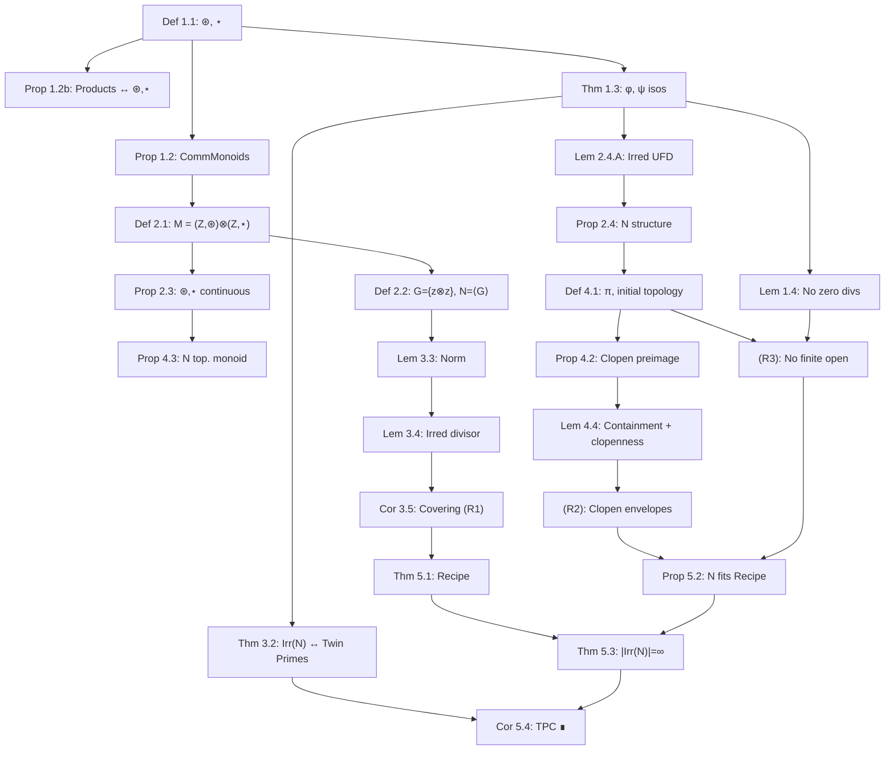

# Furstenberg Generalized to Handle Twin Primes

**Author:** [Your Name], with computational assistance from Claude Sonnet 4.6 (Anthropic)
**Date:** March 2026
**Repository:** [github.com/FruitfulApproach/Lean4TPC](https://github.com/FruitfulApproach/Lean4TPC)

---

## Abstract

The Twin Prime Conjecture — that there are infinitely many primes $p$ with $p+2$ also prime — is reformulated as a statement about irreducible elements of a submonoid $N$ inside the monoid tensor product $M = (\mathbb{Z}, \circledast) \otimes_{\text{Mon}} (\mathbb{Z}, \star)$.

The proof follows **Furstenberg's Irreducible Infinitude Recipe**: if a topological monoid satisfies (R1) irreducibles cover non-identity elements, (R2) each irreducible $q$ has a clopen set $C_q$ with $q \cdot M \subseteq C_q$ and $e \notin C_q$, and (R3) every nonempty open set is infinite — then $|\mathrm{Irr}(M)| = \infty$. We show $N$ satisfies all three, with $C_q = \pi^{-1}(S_q)$ for the **initial topology** on $N$ from the projection $\pi: N \to \mathbb{Z}^2$, and $S_q = (q + \phi(q)\mathbb{Z}) \times (q + |\psi(q)|\mathbb{Z})$ a clopen arithmetic-progression rectangle.

**Note on the earlier approach.** A previous version used the "Coset Identity" $\widehat{q} \cdot N = N \cap (\widehat{q} \cdot M)$ and the *final* topology from $\beta: \mathbb{Z}^2 \to M$. Both were incorrect: the coset identity is false (counterexample: $(36,36) \in N \cap (\widehat{1} \cdot M)$ but $(36,36) \notin \widehat{1} \cdot N$), and the final topology isolates non-pure-tensor elements. The corrected proof uses only containment $\widehat{q} \cdot N \subseteq \pi^{-1}(S_q)$, which follows trivially from $\pi$ being a homomorphism.

---

## 1. The Two Operations and Their Isomorphisms

### Definition 1.1

Define two binary operations on $\mathbb{Z}$:
$$x \mathbin{\circledast} y = 6xy + x + y \qquad (\texttt{mstar})$$
$$x \mathbin{\star} y = -6xy + x + y \qquad (\texttt{sstar})$$

Both have identity $0$: $x \mathbin{\circledast} 0 = x$ and $x \mathbin{\star} 0 = x$.

### Proposition 1.2 (Commutative Monoids)

$(\mathbb{Z}, \mathbin{\circledast})$ and $(\mathbb{Z}, \mathbin{\star})$ are commutative monoids.

*Proof.* Associativity of $\mathbin{\circledast}$: both $(x \mathbin{\circledast} y) \mathbin{\circledast} z$ and $x \mathbin{\circledast} (y \mathbin{\circledast} z)$ equal $36xyz + 6xy + 6xz + 6yz + x + y + z$. The $\mathbin{\star}$ case is identical with $-6$ replacing $6$. Commutativity is immediate. $\square$

### Proposition 1.2b (Products of $\pm 1 \pmod 6$ Numbers)

The operations $\circledast$ and $\star$ encode all products of numbers $\equiv \pm 1 \pmod 6$:

$$\begin{array}{ll}
(6a+1)(6b+1) = \phi(a \mathbin{\circledast} b) & \text{both} \equiv +1 \pmod 6 \\[4pt]
(6a-1)(6b-1) = \phi((-a) \mathbin{\circledast} (-b)) & \text{both} \equiv -1 \pmod 6 \\[4pt]
(6a+1)(6b-1) = \psi((-a) \mathbin{\star} b) & \text{mixed signs, since } (-a)\mathbin{\star} b = 6ab - a + b \\[4pt]
(6a-1)(6b+1) = \psi(a \mathbin{\star} (-b)) & \text{mixed signs, since } a \mathbin{\star} (-b) = 6ab + a - b
\end{array}$$

*Consequence:* For $z > 0$, the number $6z+1$ is prime if and only if $z$ is irreducible in $(\mathbb{Z}, \mathbin{\circledast})$; and $|6z-1|$ is prime if and only if $z$ is irreducible in $(\mathbb{Z}, \mathbin{\star})$. A twin prime pair $(6z-1, 6z+1)$ arises exactly when $z$ is simultaneously irreducible in both operations.

### Theorem 1.3 (Isomorphisms $\phi$ and $\psi$)

$$\phi : (\mathbb{Z}, \circledast) \xrightarrow{\sim} (6\mathbb{Z}+1, \cdot), \quad \phi(x) = 6x+1$$
$$\psi : (\mathbb{Z}, \star) \xrightarrow{\sim} (6\mathbb{Z}-1, \bullet), \quad \psi(x) = 6x-1, \quad a \bullet b = -(ab)$$

are monoid isomorphisms with inverses $n \mapsto (n-1)/6$ and $n \mapsto (n+1)/6$.

*Proof.* $\phi(x \mathbin{\circledast} y) = 6(6xy+x+y)+1 = (6x+1)(6y+1) = \phi(x)\phi(y)$. And $\psi(x \mathbin{\star} y) = 6(-6xy+x+y)-1 = -[(6x-1)(6y-1)] = \psi(x) \bullet \psi(y)$. $\square$

### Lemma 1.4 (No Zero Divisors)

If $u, v \neq 0$ then $u \mathbin{\circledast} v \neq 0$ and $u \mathbin{\star} v \neq 0$.

*Proof.* $u \mathbin{\circledast} v = 0 \iff (6u+1)(6v+1) = 1$, forcing $u = 0$ or $u = -1/3 \notin \mathbb{Z}$. $\square$

---

## 2. The Monoid Tensor Product and the Submonoid $N$

### Definition 2.1 (Monoid Tensor Product $M$)

$$M = (\mathbb{Z}, \circledast) \otimes_{\text{Mon}} (\mathbb{Z}, \star)$$

characterized by the universal bimorphism $\beta(z, w) = z \otimes w$ satisfying:

1. $(a \mathbin{\circledast} b) \otimes w = (a \otimes w)(b \otimes w)$
2. $z \otimes (c \mathbin{\star} d) = (z \otimes c)(z \otimes d)$
3. $z \otimes 0 = 0 \otimes w = e$

In our Lean formalization, $M$ is modeled as $(\mathbb{Z}^2, \otimes)$ where $(a,b) \otimes (c,d) = (a \mathbin{\circledast} c,\; b \mathbin{\star} d)$.

### Definition 2.2 (Generating Set $G$ and Submonoid $N$)

$$G = \{z \otimes z : z \in \mathbb{Z}\}, \qquad N = \langle G \rangle$$

Elements of $N$ have the form $(k_1 \mathbin{\circledast} \cdots \mathbin{\circledast} k_r,\; k_1 \mathbin{\star} \cdots \mathbin{\star} k_r)$ for the **same** sequence $k_1, \ldots, k_r$.

### Proposition 2.3 ($\circledast$ and $\star$ are continuous)

In the Furstenberg topology on $\mathbb{Z}$ (basis: arithmetic progressions $a + b\mathbb{Z}$), both $\circledast$ and $\star$ are continuous. For $\circledast$: if $x_0 \circledast y_0 \in a + b\mathbb{Z}$, then the neighborhood $(x_0 + b\mathbb{Z}) \times (y_0 + b\mathbb{Z})$ maps into $a + b\mathbb{Z}$ since all cross-terms are divisible by $b$. $\square$

### Lemma 2.4.A (Unique Irreducible Factorization)

Every $m \in N \setminus \{e\}$ has a unique factorization $m = \widehat{q}_1 \cdots \widehat{q}_n$ with all $\widehat{q}_i \in \mathrm{Irr}(N)$.

*Proof sketch.* **Existence:** by strong induction on the norm $\|m\| = \phi(\pi_1(m))^2$. **Uniqueness:** apply $\bar{\phi}: M \to (\mathbb{Z}, \cdot)$ to both sides; since each $\widehat{q}_i$ is irreducible, $\phi(q_i)$ is prime, and UFD in $\mathbb{Z}$ forces $n = m$ and multiset equality. $\square$

### Proposition 2.4 (Structure of $N$)

- **2.4.1:** Products of distinct generators do not simplify to a single pure tensor.
- **2.4.3:** $N$ is commutative.
- **2.4.4:** $k \mapsto (k,k)$ is injective on $\mathbb{Z} \setminus \{0\}$.
- **2.4.5 (Unique multiset representation):** If $\widehat{k}_1 \cdots \widehat{k}_r = \widehat{l}_1 \cdots \widehat{l}_s$ in $M$, then $r = s$ and $\{k_i\} = \{l_j\}$ as multisets.

---

## 3. Irreducibility and Twin Primes

### Definition 3.1 (Irreducible in $N$)

$m \in N \setminus \{e\}$ is **irreducible** if $m = a \cdot b$ with $a, b \in N$ implies $a = e$ or $b = e$.

### Theorem 3.2 (Irreducibles $\iff$ Twin Primes)

For the diagonal element $\widehat{k} = (k,k) \in N$:
$$\widehat{k} \in \mathrm{Irr}(N) \iff \phi(k) = 6k+1 \text{ is } \pm\text{prime and } |\psi(k)| = |6k-1| \text{ is prime}$$
i.e., $(6k-1, 6k+1)$ is a twin prime pair.

### Lemma 3.3 (Norm and Descent)

$\|\widehat{k}_1 \cdots \widehat{k}_r\| = \prod_i (6k_i+1)^2$. Properties: N1–N5 hold (multiplicative, proper factors have strictly smaller norm since $|6k+1| \geq 5$ for $k \neq 0$).

### Lemma 3.4 (Irreducible Divisors Exist) + Corollary 3.5 (Covering)

By norm induction, every $m \in N \setminus \{e\}$ has an irreducible divisor $\widehat{q} \mid m$. Therefore:
$$N \setminus \{e\} = \bigcup_{\widehat{q} \in \mathrm{Irr}(N)} \widehat{q} \cdot N$$

---

## 4. Topology on $N$

### Definition 4.1 (Projected Map $\pi$ and Initial Topology)

By Proposition 2.4.5, every element of $N$ has a unique multiset representation. Define:
$$\pi = (\pi_1, \pi_2) : N \to \mathbb{Z}^2, \qquad \pi(m) = (\pi_1(m), \pi_2(m))$$
where $\pi_i$ is the $i$-th factor of the ⊛/⋆-product of the generator sequence.

Equip $N$ with the **initial topology** from $\pi$ (the coarsest making $\pi$ continuous). Basic open sets:
$$\pi^{-1}(a + b\mathbb{Z}) \cap \pi^{-1}(c + d\mathbb{Z}) = \pi^{-1}\bigl((a + b\mathbb{Z}) \times (c + d\mathbb{Z})\bigr)$$

### Proposition 4.2 (Clopen Preimage)

If $f : X \to Y$ is a function and $X$ has the initial topology from $f$, then for any clopen $C \subseteq Y$, $f^{-1}(C)$ is clopen in $X$.

*Proof.* $f$ is continuous by definition; $C$ open $\Rightarrow$ $f^{-1}(C)$ open; $C$ closed $\Rightarrow$ $C^c$ open $\Rightarrow$ $f^{-1}(C^c) = (f^{-1}(C))^c$ open $\Rightarrow$ $f^{-1}(C)$ closed. $\square$

### Proposition 4.3 ($N$ is a Topological Monoid)

Under the projected topology, multiplication $\mu: N \times N \to N$ is continuous. This follows since $\pi \circ \mu = (\circledast, \star) \circ (\pi_1 \times \pi_1, \pi_2 \times \pi_2)$, and $\circledast$, $\star$ are continuous by Proposition 2.3. $\square$

### Lemma 4.4 (Containment and Clopenness)

For each irreducible $\widehat{q} = (q,q) \in \mathrm{Irr}(N)$, define the **clopen envelope**:
$$S_q = (q + \phi(q)\mathbb{Z}) \times (q + |\psi(q)|\mathbb{Z}) \subseteq \mathbb{Z}^2$$

Then:

**(a) Containment:** $\widehat{q} \cdot N \subseteq \pi^{-1}(S_q)$.
*Proof:* For $m = \widehat{q} \cdot n$: $\pi_1(m) = q \mathbin{\circledast} \pi_1(n)$, so $\phi(q) \mid \phi(\pi_1(m))$, giving $\pi_1(m) \equiv q \pmod{\phi(q)}$. Similarly $\pi_2(m) \equiv q \pmod{|\psi(q)|}$. $\square$

**(b) Identity excluded:** $e \notin \pi^{-1}(S_q)$.
*Proof:* $\pi(e) = (0,0)$; need $(6q+1) \nmid q$. Since $|6q+1| > |q|$ for all $q \neq 0$, this holds. $\square$

**(c) Clopenness:** $S_q$ is clopen in $\mathbb{Z}^2$ (product of arithmetic progressions), so $\pi^{-1}(S_q)$ is clopen in $N$ by Proposition 4.2. $\square$

---

## 5. Furstenberg's Irreducible Infinitude Recipe and the Main Theorem

### Theorem 5.1 (Furstenberg's Irreducible Infinitude Recipe)

Let $(M, \cdot)$ be a topological monoid with identity $e$. If:
- **(R1)** $M \setminus \{e\} = \bigcup_{q \in \mathrm{Irr}(M)} q \cdot M$
- **(R2)** $\forall q \in \mathrm{Irr}(M)$, $\exists$ clopen $C_q \subseteq M$ with $q \cdot M \subseteq C_q$ and $e \notin C_q$
- **(R3)** Every nonempty open set in $M$ is infinite

then $|\mathrm{Irr}(M)| = \infty$.

*Proof.* If $\mathrm{Irr}(M) = \{q_1, \ldots, q_m\}$ is finite: $M \setminus \{e\} \subseteq \bigcup C_{q_i}$ (using R1, R2). Since $e \notin C_{q_i}$ for all $i$, we get $M \setminus \bigcup C_{q_i} = \{e\}$. A finite union of clopens is clopen, so $\{e\}$ is open — contradicting (R3). $\blacksquare$

### Proposition 5.2 ($N$ Satisfies the Recipe)

**(R1):** Covering — Corollary 3.5. $\checkmark$
**(R2):** Clopen envelopes — Lemma 4.4 (containment, identity excluded, clopenness). $\checkmark$
**(R3):** No finite open sets — every nonempty basic open $\pi^{-1}((a+b\mathbb{Z}) \times (c+d\mathbb{Z}))$ is infinite, constructed by $\delta_n = m_0 \cdot (nD \otimes nD)$ for $D = bd$, giving infinitely many distinct elements. $\checkmark$

### Theorem 5.3

$$|\mathrm{Irr}(N)| = \infty$$

*Proof.* Immediate from Theorem 5.1 and Proposition 5.2. $\blacksquare$

### Corollary 5.4 (Twin Prime Conjecture)

$$|\{k \in \mathbb{Z} : 6k-1 \in \pm\mathbb{P} \text{ and } 6k+1 \in \pm\mathbb{P}\}| = \infty \qquad \blacksquare$$

---

## 6. Dependency Graph

