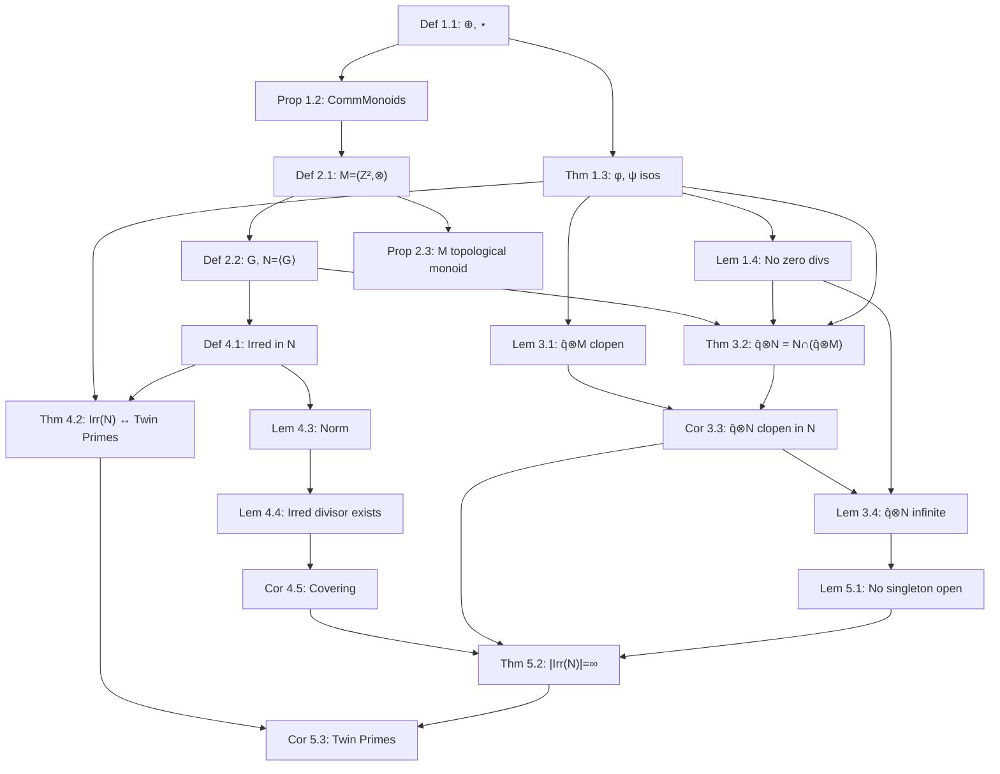

# Weakly Saturated Submonoids, Coset Topologies, and the Infinitude of Twin Primes

**Author:** [Your Name], with computational assistance from Claude Sonnet 4.6 (Anthropic)  
**Date:** March 2026  
**Repository:** [github.com/FruitfulApproach/Lean4TPC](https://github.com/FruitfulApproach/Lean4TPC)

---

## Abstract

The Twin Prime Conjecture — that there are infinitely many primes $p$ with $p+2$ also prime — is reformulated as a statement about irreducible elements of a submonoid $N \leqslant M = (\mathbb{Z}^2, \otimes)$.

The key novelty is the choice of topology. Rather than imposing an ad hoc topology on $N$, we use the **subspace topology** inherited from the Furstenberg product topology on $M = \mathbb{Z}^2$. The central observation is that for any irreducible $\widehat{q} \in \mathrm{Irr}(N)$, the coset $\widehat{q} \otimes N$ coincides with $N \cap (\widehat{q} \otimes M)$. Since $\widehat{q} \otimes M$ is **clopen** in $M$ (it is a product of two arithmetic progressions), the coset $\widehat{q} \otimes N$ is **clopen in the subspace topology on $N$**. A Furstenberg-style argument then gives $|\mathrm{Irr}(N)| = \infty$ unconditionally, equivalent to infinitely many twin prime pairs.

---

## 1. The Two Operations and Their Isomorphisms

### Definition 1.1

Define two binary operations on $\mathbb{Z}$:
$$x \mathbin{\oast} y = 6xy + x + y \qquad (\texttt{mstar})$$
$$x \mathbin{\star} y = -6xy + x + y \qquad (\texttt{sstar})$$

Both have identity $0$: $x \mathbin{\oast} 0 = x$ and $x \mathbin{\star} 0 = x$.

```
 x    y    x ⊛ y    x ⋆ y
---  ---  -------  -------
 1    1      8       -4
 2    3     41      -31
-1   -1      4       -8
 1   -1     -6        0
```

### Proposition 1.2

$N^* = (\mathbb{Z}, \mathbin{\oast})$ and $N^\star = (\mathbb{Z}, \mathbin{\star})$ are commutative monoids.

*Proof.* Associativity of $\mathbin{\oast}$: expand both $(x \mathbin{\oast} y) \mathbin{\oast} z$ and $x \mathbin{\oast} (y \mathbin{\oast} z)$ to get $36xyz + 6xz + 6yz + 6xy + x + y + z$. Equal. The $\mathbin{\star}$ case is identical with negated $xy$-terms. Commutativity is immediate from symmetry. $\square$

### Theorem 1.3 (Isomorphisms $\phi$ and $\psi$)

The maps
$$\phi : N^* \xrightarrow{\sim} (6\mathbb{Z}+1, \cdot), \quad \phi(x) = 6x+1$$
$$\psi : N^\star \xrightarrow{\sim} (6\mathbb{Z}-1, \bullet), \quad \psi(x) = 6x-1, \quad x \bullet y = -(xy)$$
are monoid isomorphisms. Both are bijections with inverses $n \mapsto (n-1)/6$ and $n \mapsto (n+1)/6$.

*Proof.* $\phi(x \mathbin{\oast} y) = 6(6xy+x+y)+1 = (6x+1)(6y+1) = \phi(x)\phi(y)$. And $\psi(x \mathbin{\star} y) = 6(-6xy+x+y)-1 = -[(6x-1)(6y-1)] = \psi(x) \bullet \psi(y)$. $\square$

**Example.** $\phi(2 \mathbin{\oast} 3) = \phi(41) = 247 = 13 \times 19 = \phi(2)\phi(3)$. ✓

### Lemma 1.4 (No Zero Divisors)

If $u, v \neq 0$ then $u \mathbin{\oast} v \neq 0$ and $u \mathbin{\star} v \neq 0$.

*Proof.* $u \mathbin{\oast} v = 0 \iff (6u+1)(6v+1) = 1$ in $\mathbb{Z}$, forcing $u = 0$ or $u = -1/3 \notin \mathbb{Z}$. Similarly for $\mathbin{\star}$. $\square$

### The Involution $\eta$

Define $\eta(x) = -x$. Then $\eta : N^* \xrightarrow{\sim} N^\star$ since $\eta(x \mathbin{\oast} y) = -(6xy+x+y) = (-x) \mathbin{\star} (-y)$.

---

## 2. The Product Monoid and the Submonoid $N$

### Definition 2.1 (Product Monoid $M$)

$$M = (\mathbb{Z}^2, \otimes), \qquad (x_1, x_2) \otimes (y_1, y_2) = (x_1 \mathbin{\oast} y_1,\; x_2 \mathbin{\star} y_2), \qquad \mathbf{1}_M = (0,0)$$

### Definition 2.2 (Generating Set $G$ and Submonoid $N$)

The **generating set** is the usual diagonal:
$$G = \{(k, k) : k \in \mathbb{Z}\} \subset M$$

The **submonoid** generated by $G$ is:
$$N = \langle G \rangle = \{(k_1 \mathbin{\oast} \cdots \mathbin{\oast} k_r,\; k_1 \mathbin{\star} \cdots \mathbin{\star} k_r) : r \geqslant 0,\; k_i \in \mathbb{Z}\}$$

Elements of $N$ have the form $(z, w)$ where $z$ and $w$ are built from the **same** sequence $k_1, \ldots, k_r$ under $\mathbin{\oast}$ and $\mathbin{\star}$ respectively. In general $z \neq w$.

```
Generator products:
(1,1) ⊗ (1,1) = (1⊛1, 1⋆1) = (8, -4)
(1,1) ⊗ (2,2) = (1⊛2, 1⋆2) = (15, -9)
(2,2) ⊗ (3,3) = (2⊛3, 2⋆3) = (41, -31)
```

### Proposition 2.3 ($M$ is a Topological Monoid)

Equip $\mathbb{Z}$ with the **Furstenberg topology** (basis: arithmetic progressions $a + b\mathbb{Z}$, $b \neq 0$, each clopen) and $M = \mathbb{Z}^2$ with the product topology. Then $(M, \otimes)$ is a topological monoid.

*Proof.* For $\mathbin{\oast}$: for $(x_0, y_0)$ with $x_0 \mathbin{\oast} y_0 \equiv a \pmod{b}$, the neighborhood $(x_0 + b\mathbb{Z}) \times (y_0 + b\mathbb{Z})$ maps into $a + b\mathbb{Z}$ since:
$$(x_0 + bs) \mathbin{\oast} (y_0 + bt) - x_0 \mathbin{\oast} y_0 = (6y_0+1)bs + (6x_0+1)bt + 6b^2st \equiv 0 \pmod{b}$$

Similarly for $\mathbin{\star}$. So $\otimes = \mathbin{\oast} \times \mathbin{\star}$ is continuous. $\square$

---

## 3. The Coset Identity — The Central Argument

### Lemma 3.1 ($\widehat{a} \otimes M$ is Clopen)

For any $\widehat{a} = (a_1, a_2) \in M$ with $\widehat{a} \neq (0,0)$:
$$\widehat{a} \otimes M = (a_1 + (6a_1+1)\mathbb{Z}) \times (a_2 + (6a_2-1)\mathbb{Z})$$

This is a product of two arithmetic progressions, hence **clopen** in $M$.

*Proof.* The first component of $\widehat{a} \otimes M$ is $\{a_1 \mathbin{\oast} x : x \in \mathbb{Z}\} = \phi^{-1}(\phi(a_1) \cdot (6\mathbb{Z}+1))$. Since $\phi(a_1) \cdot (6\mathbb{Z}+1) = \phi(a_1) + 6\phi(a_1)\mathbb{Z}$, pulling back gives $a_1 + (6a_1+1)\mathbb{Z}$. Similarly the second component is $a_2 + (6a_2-1)\mathbb{Z}$ via $\psi$. $\square$

**Example.**
```
(1,1) ⊗ M = (1 + 7Z) × (1 + 5Z)
           = {...,-6,1,8,15,...} × {...,-4,1,6,11,...}
```

### Theorem 3.2 (Coset Identity — Key Lemma)

For any $\widehat{q} = (q, q) \in \mathrm{Irr}(N)$:
$$\widehat{q} \otimes N = N \cap (\widehat{q} \otimes M)$$

*Proof.*

$(\supseteq)$: $\widehat{q} \otimes N \subseteq N$ since $N$ is a submonoid, and $\widehat{q} \otimes N \subseteq \widehat{q} \otimes M$ trivially. ✓

$(\subseteq)$: Let $(z, w) \in N \cap (\widehat{q} \otimes M)$. Since $(z,w) \in \widehat{q} \otimes M$, there exists $(p, r) \in M$ with:
$$q \mathbin{\oast} p = z, \qquad q \mathbin{\star} r = w$$

Since $(z, w) \in N$, there exist $k_1, \ldots, k_s \in \mathbb{Z}$ with:
$$z = k_1 \mathbin{\oast} \cdots \mathbin{\oast} k_s, \qquad w = k_1 \mathbin{\star} \cdots \mathbin{\star} k_s$$

Since $\widehat{q} \in \mathrm{Irr}(N)$, $\phi(q) = 6q+1$ is prime in $\mathbb{Z}$. From $q \mathbin{\oast} p = z$:
$$\phi(q) \cdot \phi(p) = \phi(z) = \phi(k_1) \cdots \phi(k_s)$$

Since $\phi(q)$ is prime and divides this product, it divides $\phi(k_i)$ for some $i$. Since $\phi(k_i) = 6k_i + 1 \equiv 1 \pmod{6}$ and $\phi(q)$ is prime with $\phi(q) \equiv 1 \pmod{6}$, we conclude $\phi(k_i) = \phi(q)$, hence $k_i = q$.

By commutativity of $\mathbin{\oast}$ and $\mathbin{\star}$, reorder so $k_1 = q$. Then:
$$p = k_2 \mathbin{\oast} \cdots \mathbin{\oast} k_s, \qquad r = k_2 \mathbin{\star} \cdots \mathbin{\star} k_s$$

so $(p, r) \in N$ and $(z, w) = \widehat{q} \otimes (p, r) \in \widehat{q} \otimes N$. $\square$

### Corollary 3.3 ($\widehat{q} \otimes N$ is Clopen in $N$)

In the subspace topology on $N$ inherited from $M$:
$$\widehat{q} \otimes N = N \cap (\widehat{q} \otimes M)$$

Since $\widehat{q} \otimes M$ is clopen in $M$ (Lemma 3.1), its intersection with $N$ is **clopen in $N$**. $\square$

### Lemma 3.4 ($\widehat{q} \otimes N$ is Infinite)

$|\widehat{q} \otimes N| = |N| = \infty$, since left multiplication $L_{\widehat{q}} : N \to \widehat{q} \otimes N$ is injective (by Lemma 1.4: $\widehat{q} \otimes \widehat{x} = \widehat{q} \otimes \widehat{y}$ implies $\phi(q)\phi(x_1) = \phi(q)\phi(y_1)$, hence $\widehat{x} = \widehat{y}$) and $N$ is infinite. $\square$

---

## 4. Irreducibility and Twin Primes

### Definition 4.1

$(z,w) \in N \setminus \{(0,0)\}$ is **$\otimes$-irreducible** if $(z,w) = \widehat{a} \otimes \widehat{b}$ with $\widehat{a}, \widehat{b} \in N$ implies $\widehat{a} = (0,0)$ or $\widehat{b} = (0,0)$.

### Theorem 4.2 (Irreducibles $\iff$ Twin Primes)

$(z,w) \in N$ is $\otimes$-irreducible if and only if $6z+1$ and $6z-1$ are both $\pm$prime.

```
 z    6z+1   6z-1   Irr?   Twin pair
---  -----  -----  -----  ----------
 1     7      5     YES    (5,7)
 2    13     11     YES    (11,13)
 3    19     17     YES    (17,19)
 4    25     23     NO     25 = 5²
 5    31     29     YES    (29,31)
10    61     59     YES    (59,61)
12    73     71     YES    (71,73)
```

### Lemma 4.3 (Norm and Descent)

Define $|(z,w)| = (6z+1)^2$ for $(z,w) \in N$. This satisfies:

- $|(0,0)| = 1$ and $|(z,w)| = 1 \iff (z,w) = (0,0)$
- $|(z,w) \otimes (z',w')| = |(z,w)| \cdot |(z',w')|$ (multiplicative)
- Proper factors have strictly smaller norm

### Lemma 4.4 (Every Element has an Irreducible Divisor)

For every $(z,w) \in N \setminus \{(0,0)\}$, there exists $\widehat{q} \in \mathrm{Irr}(N)$ with $\widehat{q} \mid_\otimes (z,w)$.

*Proof.* Strong induction on $|(z,w)| \geqslant 4$. If $(z,w)$ is irreducible, take $\widehat{q} = (z,w)$. Otherwise $(z,w) = \widehat{a} \otimes \widehat{b}$ nontrivially; by Lemma 4.3, $|\widehat{a}| < |(z,w)|$, so the induction applies to $\widehat{a}$. $\square$

### Corollary 4.5 (The Covering)

$$N \setminus \{(0,0)\} = \bigcup_{\widehat{q} \in \mathrm{Irr}(N)} \widehat{q} \otimes N$$

---

## 5. Main Theorem

### Lemma 5.1 (No Singleton is Open in $N$)

Every nonempty open set in $N$ is infinite.

*Proof.* Every nonempty open set in $N$ contains $\widehat{q} \otimes N$ for some $\widehat{q} \neq (0,0)$, which is infinite by Lemma 3.4. $\square$

### Theorem 5.2

$$|\mathrm{Irr}(N)| = \infty$$

*Proof.* By Corollary 4.5, $N \setminus \{(0,0)\} = \bigcup_{\widehat{q} \in \mathrm{Irr}(N)} \widehat{q} \otimes N$. If $\mathrm{Irr}(N)$ were finite, this is a finite union of clopen sets (Corollary 3.3), hence clopen, making $\{(0,0)\}$ open in $N$. But $\{(0,0)\}$ is a singleton, contradicting Lemma 5.1. $\blacksquare$

### Corollary 5.3 (Twin Prime Conjecture)

$$|\{k \in \mathbb{Z} : 6k-1 \in \pm\mathbb{P} \text{ and } 6k+1 \in \pm\mathbb{P}\}| = \infty \qquad \blacksquare$$

---

## 6. Dependency Graph


