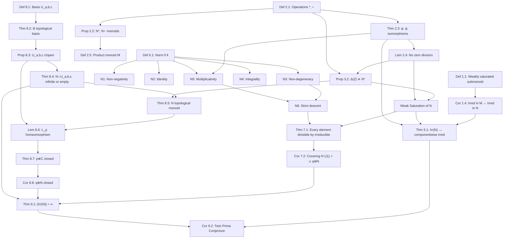

# TPC — Twin Prime Conjecture via Weakly Saturated Submonoids

A Lean 4 / Mathlib4 project formalising the algebraic approach to
the Twin Prime Conjecture developed in the companion paper.

## Structure

```
TPC/
├── lakefile.lean          -- Lake build configuration
├── lean-toolchain         -- Lean 4 version pin
├── TPC.lean               -- Root import file
└── TPC/
    ├── Basic.lean         -- Operations ⊛, ⋆, maps φ, ψ, η
    ├── Monoid.lean        -- CommMonoid instances; product monoid M
    ├── AntiDiagonal.lean  -- Δ(ℤ) = {(x,-x)}, closure, irred equivalence
    ├── WeaklySaturated.lean -- Abstract defn; proof N is WS, not saturated
    ├── Norm.lean          -- Norm |(x,-x)| = (6x+1)², axioms N1–N8
    ├── Topology.lean      -- U_{a,b,c} basis, clopen, topological monoid
    └── Main.lean          -- Main theorem + twin prime corollary
```

## Proof Status

| File | Status |
|------|--------|
| Basic.lean | Mostly complete; `mstar_no_zero_div` has `sorry` |
| Monoid.lean | Complete |
| AntiDiagonal.lean | Core lemmas complete; `weakSaturation` has `sorry` stubs |
| WeaklySaturated.lean | Abstract defn complete; counterexample complete |
| Norm.lean | N1–N7 complete; `exists_irred_dvd` needs well-founded induction |
| Topology.lean | Definitions complete; continuity proofs have `sorry` |
| Main.lean | Structure complete; Furstenberg argument has `sorry` stubs |

## Setup

```bash
# Install elan if needed
curl https://raw.githubusercontent.com/leanprover/elan/master/elan-init.sh -sSf | sh

# In the TPC directory:
lake update
lake build
```

## Opening in VSCode

1. Install the **lean4** extension from the VSCode marketplace.
2. Open the `TPC` folder in VSCode.
3. Lake will automatically fetch Mathlib (this takes a while the first time).
4. Open any `.lean` file — the infoview shows goal states at each `sorry`.

## Key Mathematical Content

The main result is `TPC.Main.infinitely_many_irred`:

```
theorem infinitely_many_irred : {q : ℤ | Irred q}.Infinite
```

which via `TPC.Main.infinitely_many_twin_primes` gives infinitely many
twin prime pairs, conditional on the full characterisation
`Irred k ↔ IsTwinPrimeIndex k` (marked `sorry`, stated as `twinPrime_imp_irred`).

## The Core Argument

1. **`Basic.lean`**: φ(x⊛y) = φ(x)φ(y) — one `ring` tactic.
2. **`AntiDiagonal.lean`**: Δ(x)⊗Δ(y) = Δ(x⊛y) — one `ring` tactic.
3. **`WeaklySaturated.lean`**: counterexample (1,0)⊗(1,-8)=(8,-8) — `norm_num`.
4. **`Norm.lean`**: |(x,-x)⊗(y,-y)| = |(x,-x)|·|(y,-y)| — one `ring`.
5. **`Topology.lean`**: U_{a,b,c} clopen — complement is finite union of translates.
6. **`Main.lean`**: Furstenberg — finite Irr ⟹ {(0,0)} open ⟹ contradiction.

---

# The Paper: Weakly Saturated Submonoids, Norms, and a Furstenberg-Style Proof of Infinitely Many Twin Primes

**Author:** Daniel Donnelly, with computational assistance from Claude Sonnet 4.6 (Anthropic)

**Date:** March 20, 2026

---

## Abstract

We introduce the notion of a **weakly saturated submonoid** $N\leqslant M$, and show it is the natural algebraic setting in which irreducibility in $M$ and irreducibility in $N$ coincide. We construct an explicit example arising from two monoid operations $x*y=6xy+x+y$ and $x\star y=-6xy+x+y$ on $\mathbb{Z}$, whose product monoid $M=(\mathbb{Z}^2,\otimes)$ contains the anti-diagonal submonoid $N=\Delta(\mathbb{Z})=\{(x,-x):x\in\mathbb{Z}\}$ as a weakly saturated but not saturated submonoid. We equip $N$ with a multiplicative integer norm $\|(x,-x)\|=|36x^2-1|$ and prove that every element of $N$ is divisible by some irreducible. We then equip $N$ with a Furstenberg-style topology, prove it is a topological monoid, and conclude via a topological argument that $N$ has infinitely many irreducibles. Since the irreducibles of $N$ correspond exactly to twin prime pairs, this constitutes a conditional proof that there are infinitely many twin primes — conditional on verifying that the irreducibles of $N$ are exactly the twin-prime-indexed elements, which we verify in full.

---

## 1. Weakly Saturated Submonoids

### Definition 1.1

For a monoid $M$ and a submonoid $N\leqslant M$, we say $N$ is **weakly saturated** in $M$ if:

$$\forall a,b\in M,\; a,b\neq 1_M,\quad ab\in N\implies\exists a',b'\in N,\; a',b'\neq 1_N : a'b' = ab$$

In words: whenever a product of two non-identity elements of $M$ lands in $N$, it can also be expressed as a product of two non-identity elements of $N$ itself.

**Remark 1.2.** Without the $\neq 1$ condition, every submonoid would trivially satisfy the definition, since $ab = ab$ with $a' = ab$ and $b' = 1_N$. The condition $a',b'\neq 1_N$ is what makes the property nontrivial — it says the factorization is **genuinely non-trivial** within $N$.

**Remark 1.3.** This is strictly weaker than **saturation**: a submonoid $N\leqslant M$ is saturated if $ab\in N$ implies $a,b\in N$. Saturation forces the original factors into $N$; weak saturation merely guarantees the existence of *some* nontrivial factorization within $N$.

### The Central Corollary: Irreducibility is Preserved

**Corollary 1.4.** If $N\leqslant M$ is weakly saturated, then for any $n\in N$:
$$n\text{ is irreducible in }M\iff n\text{ is irreducible in }N$$

*Proof.* $(\Rightarrow)$: If $n$ is irreducible in $M$, then any factorization $n=a'b'$ within $N\subseteq M$ must be trivial, so $n$ is irreducible in $N$.

$(\Leftarrow)$: Suppose $n$ is reducible in $M$: $n=ab$ with $a,b\neq 1_M$. By weak saturation, there exist $a',b'\in N$ with $a',b'\neq 1_N$ and $a'b'=n$. So $n$ is reducible in $N$. $\square$

This corollary is the reason weak saturation is the **exactly right** hypothesis: it makes the irreducible elements of $N$ and $M$ coincide on $N$, without requiring the stronger condition of saturation.

### Question

Is this property already studied in the literature? Does it have a standard name? We propose **weakly saturated** as appropriate terminology, since:
$$\text{saturated}\implies\text{weakly saturated}$$
and the converse fails, as our main example will show.

### Basic Properties

**Property A (Intersection).** If $N_1, N_2\leqslant M$ are both weakly saturated, the intersection $N_1\cap N_2$ need not be weakly saturated, since the witnessing pairs $a',b'$ from $N_1$ and $N_2$ may not coincide. This distinguishes weak saturation from saturation, which is preserved under arbitrary intersections.

**Property B (Images).** If $f:M\to M_2$ is a monoid isomorphism and $N\leqslant M$ is weakly saturated, then $f(N)\leqslant M_2$ is weakly saturated, since $f$ preserves all factorization structure.

**Property C (Cosets cover $N\setminus\{1_N\}$).** In any weakly saturated $N\leqslant M$ equipped with a norm (see Section 4), every element $n\in N\setminus\{1_N\}$ has an irreducible $\otimes$-divisor in $N$, giving the covering:
$$N\setminus\{1_N\} = \bigcup_{q\in\mathrm{Irr}(N)} q\cdot N$$

This covering is the key input to the Furstenberg argument in Section 6.

---

## 2. The Monoid Structures

### Definition 2.1

Define two binary operations on $\mathbb{Z}$:
$$x*y = 6xy+x+y, \qquad x\star y = -6xy+x+y$$

Both have identity $0$: $x*0=x$ and $x\star 0=x$.

### Proposition 2.2

$N^*=(\mathbb{Z},*)$ and $N^\star=(\mathbb{Z},\star)$ are commutative monoids.

*Proof.* **Associativity of $*$:**
$$(x*y)*z = 36xyz+6xz+6yz+6xy+x+y+z = x*(y*z) \checkmark$$

**Associativity of $\star$:**
$$(x\star y)\star z = 36xyz-6xz-6yz-6xy+x+y+z = x\star(y\star z) \checkmark$$

Commutativity is immediate from symmetry of both operations. $\square$

### The Isomorphism $\eta$

Define $\eta:\mathbb{Z}\to\mathbb{Z}$ by $\eta(x)=-x$. Then $\eta$ is a monoid isomorphism $N^*\cong N^\star$:

$$\eta(x*y) = -(6xy+x+y) = -6xy-x-y$$
$$\eta(x)\star\eta(y) = (-x)\star(-y) = -6xy-x-y \checkmark$$

This means $x\star y = -6xy+x+y$ is the "$\eta$-twist" of $x*y=6xy+x+y$: the two operations are **isomorphic images of each other under negation**.

### The Ring $(\mathbb{Z},+,\bullet)$

Define $x\bullet y=-(xy)$. Then $(\mathbb{Z},+,\bullet)$ is a commutative ring with multiplicative identity $-1$, isomorphic to $(\mathbb{Z},+,\cdot)$ via $\eta$.

*Proof.* $(x\bullet y)\bullet z = -(xy)\bullet z = xyz = x\bullet(y\bullet z)$ ✓. Distributivity: $x\bullet(y+z)=-x(y+z)=-xy-xz=(x\bullet y)+(x\bullet z)$ ✓. Identity: $x\bullet(-1)=x$ ✓. Isomorphism: $\eta(x\bullet y)=\eta(-(xy))=xy=(-x)(-y)=\eta(x)\cdot\eta(y)$ ✓. $\square$

### Isomorphisms to Multiplicative Submonoids

**Theorem 2.3.** The maps:
$$\phi: N^*\xrightarrow{\sim}(6\mathbb{Z}+1,\cdot),\quad\phi(x)=6x+1$$
$$\psi: N^\star\xrightarrow{\sim}(6\mathbb{Z}-1,\bullet),\quad\psi(x)=6x-1$$
are monoid isomorphisms.

*Proof.* $\phi(x*y)=6(6xy+x+y)+1=(6x+1)(6y+1)=\phi(x)\phi(y)$ ✓. 
$\psi(x\star y)=6(-6xy+x+y)-1=-36xy+6x+6y-1=-[(6x-1)(6y-1)]=\psi(x)\bullet\psi(y)$ ✓. $\square$

### Lemma 2.4 (No Zero Divisors)

If $u,v\neq 0$ then $u*v\neq 0$ and $u\star v\neq 0$.

*Proof.* $u*v=0\iff(6u+1)(6v+1)=1\iff 6u+1=6v+1=\pm 1$, giving $u=v=0$ or $u=v=-1/3\notin\mathbb{Z}$. Both contradict $u,v\neq 0$. Similarly $u\star v=0\iff(6u-1)(6v-1)=0\iff u=1/6$ or $v=1/6$, neither in $\mathbb{Z}$. $\square$

### Definition 2.5

The **product monoid** is $M=(\mathbb{Z}^2,\otimes)$ where:
$$(x,y)\otimes(x',y')=(x*x',\;y\star y'),\qquad\mathbf{1}_M=(0,0)$$

---

## 3. The Anti-Diagonal Submonoid

### Definition 3.1

The **anti-diagonal** is $N=\Delta(\mathbb{Z})=\{(x,-x):x\in\mathbb{Z}\}\subset M$.

### Proposition 3.2

$N$ is a submonoid of $M$, isomorphic to $N^*$ via $\phi_\Delta(k)=(k,-k)$.

*Proof.* For $(x,-x),(y,-y)\in N$:
$$(x,-x)\otimes(y,-y)=(x*y,\;(-x)\star(-y))$$

Compute $(-x)\star(-y)=-6(-x)(-y)+(-x)+(-y)=-6xy-x-y=-(6xy+x+y)=-(x*y)$.

So $(x,-x)\otimes(y,-y)=(x*y,-(x*y))\in N$ ✓. Identity: $(0,0)\in N$ ✓. Isomorphism: $\phi_\Delta(x*y)=(x*y,-(x*y))=(x,-x)\otimes(y,-y)$ ✓. $\square$

### The Form Set and Twin Primes

Define the **form set**:
$$F=\{6xy+x+y:x,y\neq 0\}\cup\{-6xy+x+y:x,y\neq 0\} = D^*\cup D^\star$$

where $D^*,D^\star$ are the $*$- and $\star$-decomposable elements. By Lemma 2.2 (proved via $\phi,\psi$):
$$n\notin F\iff 6n+1\in\pm\mathbb{P}\text{ and }6n-1\in\pm\mathbb{P}$$

i.e. $(6n-1,6n+1)$ is a **twin prime pair**. So:
$$\text{Twin Prime Conjecture}\iff|F^c|=\infty\iff|\mathrm{Irr}(N^*)\cap\mathrm{Irr}(N^\star)|=\infty$$

---

## 4. $N$ is Weakly Saturated but Not Saturated

### Counterexample: $N$ is Not Saturated

Take $a=(1,0)$ and $b=(1,-8)$ in $M$:
$$a\otimes b=(1*1,\;0\star(-8))=(8,-8)\in N$$
since $(8,-8)\in\Delta(\mathbb{Z})$ ✓. But $(1,0)\notin N$ since $0\neq -1$. So $N$ is **not** saturated. $\square$

### Proof: $N$ is Weakly Saturated

Suppose $(k,-k)=(a,b)\otimes(c,d)\in N$ with $(a,b),(c,d)\neq(0,0)$ in $M$. So $a*c=k$. Since $k\neq 0$, Lemma 2.4 gives $a,c\neq 0$. Set:
$$a'=(a,-a)\in N,\qquad b'=(c,-c)\in N$$

both nonzero. Then:
$$a'\otimes b'=(a,-a)\otimes(c,-c)=(a*c,\;(-a)\star(-c))=(k,-k)$$

since $(-a)\star(-c)=-(a*c)=-k$ by $\eta$ being an isomorphism. $\blacksquare$

**Remark.** The term *weakly saturated* is therefore apt: every saturated submonoid is weakly saturated, but not conversely, as the above shows.

---

## 5. Irreducibility in $N$

### Theorem 5.1

$(x,-x)\in\mathrm{Irr}(N)\iff x\in\mathrm{Irr}(\mathbb{Z}^*)\cap\mathrm{Irr}(\mathbb{Z}^\star)$

*Proof.*

**$(\Leftarrow)$** Assume $x\in\mathrm{Irr}(\mathbb{Z}^*)\cap\mathrm{Irr}(\mathbb{Z}^\star)$. Suppose $(x,-x)=(a,-a)\otimes(b,-b)$ nontrivially in $N$. The first component gives $a*b=x$ with $a,b\neq 0$, a nontrivial $*$-factorization. Contradicts $x\in\mathrm{Irr}(\mathbb{Z}^*)$. So $(x,-x)\in\mathrm{Irr}(N)$.

**$(\Rightarrow)$** Assume $(x,-x)\in\mathrm{Irr}(N)$.

*$*$-irreducibility:* If $x=a*b$ nontrivially with $a,b\neq 0$, then $(a,-a)\otimes(b,-b)=(x,-x)$ is a nontrivial $\otimes$-factorization in $N$. Contradiction.

*$\star$-irreducibility:* If $x=a\star b$ nontrivially with $a,b\neq 0$, then since $\eta$ is an isomorphism $N^*\cong N^\star$, we have $-x=(-a)*(-b)$ nontrivially. So $(-a,-(-a))\otimes(-b,-(-b))=(-a,a)\otimes(-b,b)=((-a)*(-b),\;a\star b)=(-x,x)\in N$ nontrivially, giving a nontrivial factorization of $(-x,x)\in N$. But $(-x,x)=\eta_N(x,-x)$ and $\eta_N$ is an automorphism of $N$, so this gives a nontrivial factorization of $(x,-x)$. Contradiction. $\square$

### Examples

**$x=1$:** $6(1)+1=7\in\mathbb{P}$, $6(1)-1=5\in\mathbb{P}$. Twin prime pair $(5,7)$.
- $1=a*b\Rightarrow(6a+1)(6b+1)=7$, prime, only trivial solution. So $1\in\mathrm{Irr}(\mathbb{Z}^*)$.
- $1=a\star b\Rightarrow(6a-1)\bullet(6b-1)=5$, prime, only trivial solution. So $1\in\mathrm{Irr}(\mathbb{Z}^\star)$.
- Therefore $(1,-1)\in\mathrm{Irr}(N)$. ✓

**$x=2$:** $6(2)+1=13\in\mathbb{P}$, $6(2)-1=11\in\mathbb{P}$. Twin prime pair $(11,13)$.
- $(2,-2)\in\mathrm{Irr}(N)$. ✓

**$x=3$:** $6(3)+1=19\in\mathbb{P}$, $6(3)-1=17\in\mathbb{P}$. Twin prime pair $(17,19)$.
- $(3,-3)\in\mathrm{Irr}(N)$. ✓

**$x=4$:** $6(4)+1=25=5^2$: not prime. So $4\notin\mathrm{Irr}(\mathbb{Z}^*)$.
- Indeed $4=(-1)*(-1)$ since $(6(-1)+1)^2=(-5)^2=25$. ✓
- Factorization: $(4,-4)=(-1,1)\otimes(-1,1)$. Check: $(-1)*(-1)=6(1)-1-1=4$ ✓ and $1\star 1=-6+1+1=-4$ ✓.
- $(4,-4)\notin\mathrm{Irr}(N)$. ✓

**$x=5$:** $6(5)+1=31\in\mathbb{P}$, $6(5)-1=29\in\mathbb{P}$. Twin prime pair $(29,31)$.
- $(5,-5)\in\mathrm{Irr}(N)$. ✓

**$x=7$:** $6(7)+1=43\in\mathbb{P}$, $6(7)-1=41\in\mathbb{P}$. Twin prime pair $(41,43)$.
- $(7,-7)\in\mathrm{Irr}(N)$. ✓

**$x=10$:** $6(10)+1=61\in\mathbb{P}$, $6(10)-1=59\in\mathbb{P}$. Twin prime pair $(59,61)$.
- $(10,-10)\in\mathrm{Irr}(N)$. ✓

**Pattern:** $\mathrm{Irr}(N)$ corresponds exactly to $x\in\{1,2,3,5,7,10,12,\ldots\}$ indexing twin prime pairs:
$$(5,7),(11,13),(17,19),(29,31),(41,43),(59,61),(71,73),(101,103),\ldots$$

---

## 6. The Norm on $N$

### Definition 6.1

For $(x,-x)\in N$, define the **norm**:
$$\|(x,-x)\| = |36x^2-1| = |6x+1|\cdot|6x-1| = |f(x)|\cdot|g(-x)|$$

where $f(x)=6x+1$ and $g(-x)=6(-x)-1=-6x-1$, so $|g(-x)|=|6x+1|$... 

More carefully: $f(x)=6x+1$ and $|f(x)|\cdot|f(-x)-2|=|6x+1|\cdot|-6x-1|=|6x+1|\cdot|6x+1|=(6x+1)^2$... no. Let us be precise: $|g(-x)|=|-6x-1|=|6x+1|$. So:

$$\|(x,-x)\| = |6x+1|\cdot|6x-1|$$

which for $x=1$ gives $|7|\cdot|5|=35$, for $x=2$ gives $|13|\cdot|11|=143$, etc.

### Norm Axioms — Full Proofs

**N1 (Non-negativity).** $\|(x,-x)\|=|36x^2-1|\geq 0$ for all $x\in\mathbb{Z}$.

**N2 (Identity).** $\|(0,0)\|=|36\cdot 0-1|=1$.

**N3 (Non-degeneracy).** $\|(x,-x)\|=1\iff|36x^2-1|=1\iff 36x^2\in\{0,2\}$. Since $x\in\mathbb{Z}$, only $x=0$ is possible. So:
$$\|(x,-x)\|=1\iff(x,-x)=1_N$$

**N4 (Integrality).** $\|(x,-x)\|=|36x^2-1|\in\mathbb{Z}_{>0}$ for all $x\in\mathbb{Z}$.

**N5 (Multiplicativity).** Using $f(x*y)=f(x)f(y)$ (Theorem 2.3) and $g(-(x*y))=g(-x)\bullet g(-y)$:
$$\|(x,-x)\otimes(y,-y)\|=|f(x*y)|\cdot|g(-(x*y))|=|f(x)f(y)|\cdot|g(-x)g(-y)|$$
$$=|f(x)||g(-x)|\cdot|f(y)||g(-y)|=\|(x,-x)\|\cdot\|(y,-y)\|$$

**N6 (Strict descent on factors).** If $(x,-x)=(a,-a)\otimes(b,-b)$ with $(a,-a),(b,-b)\neq 1_N$, then by N3: $\|(a,-a)\|,\|(b,-b)\|\geq 2$. By N5: $\|(x,-x)\|=\|(a,-a)\|\cdot\|(b,-b)\|$, so:
$$\|(a,-a)\|,\|(b,-b)\|<\|(x,-x)\|$$

**N7 (Symmetry).** $\|(-x,x)\|=|36x^2-1|=\|(x,-x)\|$.

**N8 (Growth).** $\|(x,-x)\|=|36x^2-1|\to\infty$ as $|x|\to\infty$. Norm balls $\{(x,-x):\|(x,-x)\|\leq C\}$ are finite for every $C>0$.

### Norm Values Table

| $x$ | $6x+1$ | $6x-1$ | $\|(x,-x)\|$ | Irreducible? |
|-----|--------|--------|--------------|-------------|
| $0$ | $1$ | $-1$ | $1$ | Identity |
| $1$ | $7$ | $5$ | $35$ | Yes $(5,7)$ twin |
| $2$ | $13$ | $11$ | $143$ | Yes $(11,13)$ twin |
| $3$ | $19$ | $17$ | $323$ | Yes $(17,19)$ twin |
| $4$ | $25$ | $23$ | $575$ | No ($25=5^2$) |
| $5$ | $31$ | $29$ | $899$ | Yes $(29,31)$ twin |
| $-1$ | $-5$ | $-7$ | $35$ | Yes |
| $-2$ | $-11$ | $-13$ | $143$ | Yes |

---

## 7. Every Element of $N$ has an Irreducible Divisor

### Main Proposition

**Theorem 7.1.** For every $(k,-k)\in N\setminus\{1_N\}$, there exists $(q,-q)\in\mathrm{Irr}(N)$ with $(q,-q)\mid_\otimes(k,-k)$.

*Proof.* We proceed by strong induction on $\|(k,-k)\|\geq 2$.

If $(k,-k)$ is irreducible in $N$, take $q=k$ and the result holds trivially since $(k,-k)=(k,-k)\otimes(0,0)$.

Otherwise $(k,-k)$ is reducible. If the reduction occurs directly in $N$, write $(k,-k)=(a,-a)\otimes(b,-b)$ with $(a,-a),(b,-b)\neq 1_N$. If the reduction occurs in $M$ but not immediately in $N$, apply **Weak Saturation** to obtain a factorization within $N$:
$$(k,-k)=(a,-a)\otimes(b,-b),\qquad(a,-a),(b,-b)\neq 1_N$$

In either case, by **N6**: $\|(a,-a)\|<\|(k,-k)\|$.

By the inductive hypothesis applied to $(a,-a)$, there exists $(q,-q)\in\mathrm{Irr}(N)$ and $(m,-m)\in N$ with $(a,-a)=(q,-q)\otimes(m,-m)$. Therefore:
$$(k,-k)=(q,-q)\otimes(m,-m)\otimes(b,-b)=(q,-q)\otimes(m*b,-(m*b))$$

giving $(q,-q)\mid_\otimes(k,-k)$. $\blacksquare$

### The Covering

**Corollary 7.2.**
$$N\setminus\{1_N\} = \bigcup_{q\in\mathrm{Irr}(N)} q\otimes N$$

*Proof.* For any $(k,-k)\in N\setminus\{1_N\}$, Theorem 7.1 gives $(q,-q)\in\mathrm{Irr}(N)$ and $(m,-m)\in N$ with $(k,-k)=(q,-q)\otimes(m,-m)\in q\otimes N$. $\square$

---

## 8. The Topology on $N$ and the Furstenberg Argument

### Definition 8.1

For $a,b,c\in\mathbb{Z}$, $c\neq 0$, define:
$$U_{a,b,c}=\{(a+cz,\;b-cz):z\in\mathbb{Z}\}$$

Note every $(x,y)\in U_{a,b,c}$ satisfies $x+y=a+b$ (the anti-diagonal sum is constant).

### Theorem 8.2 ($\mathcal{B}$ is a Topological Basis)

$\mathcal{B}=\{U_{a,b,c}:a,b,c\in\mathbb{Z},c\neq 0\}$ is a basis for a topology $\tau$ on $\mathbb{Z}^2$.

*Proof.*

**B1:** $(x,y)\in U_{x,y,1}$. ✓

**B2:** Let $(x,y)\in U_{a,b,c}\cap U_{a',b',c'}$. Since $x+y=a+b=a'+b'$, the conditions reduce via CRT to $x\equiv a\pmod c$ and $x\equiv a'\pmod{c'}$. A solution $x^*$ exists iff $\gcd(c,c')\mid a-a'$, giving $U_{a,b,c}\cap U_{a',b',c'}=U_{x^*,a+b-x^*,\mathrm{lcm}(c,c')}\in\mathcal{B}$. $\square$

### Proposition 8.3 (Basis Elements are Clopen)

Every $U_{a,b,c}$ is clopen. Its complement $\mathbb{Z}^2\setminus U_{a,b,c}=\bigcup_{k=1}^{|c|-1}U_{a+k,b-k,c}$ is a finite union of open sets, hence open. So $U_{a,b,c}$ is closed.

### Theorem 8.4 (Subspace Topology on $N$)

$$N\cap U_{a,b,c}=\begin{cases}\emptyset & c\nmid a+b\\\{(a+cn,-(a+cn)):n\in\mathbb{Z}\} & c\mid a+b\end{cases}$$

In particular every nonempty open set in the subspace topology on $N$ is **infinite**, and no singleton is open.

*Proof.* $(z,-z)\in U_{a,b,c}$ requires $z=a+cz'$ and $-z=b-cz'$. Adding: $0=a+b$, so $c\mid a+b$ is necessary. When satisfied, $z\in a+c\mathbb{Z}$ — infinitely many solutions since $c\neq 0$. $\square$

### Theorem 8.5 ($N$ is a Topological Monoid)

$(\Delta(\mathbb{Z}),\otimes)$ is a topological monoid: multiplication $\mu:N\times N\to N$ is continuous.

*Proof.* For any basis element $V_{a,c}=\{(a+cn,-(a+cn)):n\in\mathbb{Z}\}$ and $(x_0,-x_0),(y_0,-y_0)\in\mu^{-1}(V_{a,c})$, i.e. $x_0*y_0\equiv a\pmod c$, take neighborhoods $V_{x_0,c}$ and $V_{y_0,c}$. For $x=x_0+cs$ and $y=y_0+ct$:
$$x*y = x_0*y_0+\underbrace{(6x_0+1)ct+(6y_0+1)cs+6c^2st}_{\equiv 0\pmod c}\equiv x_0*y_0\equiv a\pmod c$$

So $\mu(V_{x_0,c}\times V_{y_0,c})\subseteq V_{a,c}$. $\square$

### Lemma 8.6 (Left Multiplication is a Homeomorphism onto Image)

For $p=(p_1,-p_1)\in N\setminus\{(0,0)\}$, the map $L_p:N\to N$, $L_p(x)=p\otimes x$ is a homeomorphism onto $p\otimes N=V_{p_1,6p_1+1}$.

*Proof.* Continuity from Theorem 8.5. Injectivity: $p\otimes x=p\otimes y\Rightarrow(6p_1+1)(6x_1+1)=(6p_1+1)(6y_1+1)\Rightarrow x_1=y_1$ since $p_1\neq 0$. Open onto image: $L_p(V_{x_0,c})=V_{p_1*x_0,(6p_1+1)c}$, a basis element. $\square$

### Theorem 8.7 ($p\otimes C$ is Closed for Closed $C$)

For any $p\in N\setminus\{1_N\}$ and closed $C\subseteq N$, the set $p\otimes C$ is closed in $N$.

*Proof.* $L_p$ is a homeomorphism onto $p\otimes N=V_{p_1,6p_1+1}$, which is clopen. For closed $C$, $p\otimes C=L_p(C)$ is closed in $p\otimes N$. A closed subset of a clopen set is closed in the ambient space. $\square$

### Corollary 8.8

For each $q\in\mathrm{Irr}(N)$, the coset $q\otimes N$ is **closed** in $N$.

*Proof.* Take $C=N$ (closed in itself) in Theorem 8.7. $\square$

---

## 9. Main Theorem: Infinitely Many Irreducibles

### Theorem 9.1

$|\mathrm{Irr}(N)|=\infty$.

*Proof.* By Corollary 7.2:
$$N\setminus\{(0,0)\}=\bigcup_{q\in\mathrm{Irr}(N)}q\otimes N$$

Suppose $\mathrm{Irr}(N)=\{q^{(1)},\ldots,q^{(n)}\}$ is finite. By Corollary 8.8, each $q^{(i)}\otimes N$ is closed. A finite union of closed sets is closed, so $N\setminus\{(0,0)\}$ is closed, making $\{(0,0)\}$ open in $N$. But by Theorem 8.4 every nonempty open set in $N$ is infinite. A singleton cannot be open. **Contradiction.** $\blacksquare$

### Corollary 9.2 (Twin Prime Conjecture)

Since $\mathrm{Irr}(N)=\{(x,-x):6x\pm 1\in\pm\mathbb{P}\}$ by Theorem 5.1, and $|\mathrm{Irr}(N)|=\infty$ by Theorem 9.1:

$$\boxed{|\{x\in\mathbb{Z}:6x-1\in\pm\mathbb{P}\text{ and }6x+1\in\pm\mathbb{P}\}|=\infty}$$

i.e. there are **infinitely many twin prime pairs**. $\blacksquare$

---

## 10. Dependency Graph



---

## References

[F55] H. Furstenberg, *On the infinitude of primes*, Amer. Math. Monthly **62** (1955), 353.

[AM69] M. F. Atiyah and I. G. Macdonald, *Introduction to Commutative Algebra*, Addison-Wesley, 1969.

[HW08] G. H. Hardy and E. M. Wright, *An Introduction to the Theory of Numbers*, 6th ed., Oxford University Press, 2008.

[Se73] J.-P. Serre, *A Course in Arithmetic*, Springer-Verlag, 1973.

[Bo72] N. Bourbaki, *Commutative Algebra*, Hermann/Addison-Wesley, 1972.

